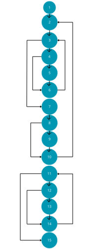

# <span style='color:blue'> **MP-2024-C7-G2** </span>

---

## Índice

-   [ **MP-2024-C7-G2** ](#-nombre-del-proyecto-)
    -   [Índice](#índice)
-   [Documentación de usuario](#documentación-de-usuario)
    -   [Descripción funcional](#descripción-funcional)
    -   [Tecnología](#tecnología)
    -   [Manual de instalación](#manual-de-instalación-por-hacer)
    -   [Acceso al sistema](#acceso-al-sistema-por-hacer)
    -   [Manual de referencia](#manual-de-referencia-por-hacer)
    -   [Guía del operador](#guía-del-operador-por-hacer)
-   [Documentación del sistema](#documentación-del-sistema)
    -   [Especificación del sistema](#especificación-del-sistema)
    -   [Módulos](#módulos)
    -   [Plan de prueba](#plan-de-prueba)
        -   [Prueba de los módulos](#prueba-de-los-módulos)
            -   [MODULO PRINCIPAL](#modulo-principal)
            -   [MODULO SESIONES](#modulo-sesiones)
            -   [MODULO PRODUCTOS](#modulo-productos)
            -   [MODULO DESCUENTOS](#modulo-descuentos)
            -   [MODULO PEDIDOS/DEVOLUCIONES](#modulo-pedidos-devoluciones)
        -   [Prueba de integración](#prueba-de-integración)
        -   [Plan de pruebas de aceptación](#plan-de-pruebas-de-aceptación)
-   [Documentación del código fuente](#documentación-del-código-fuente)

---

<div id='usuarios' />

# Documentación de usuarios

Una vez ejecutado el programa, le pregutará con qué tipo de usuario desea acceder a la plataforma, siendo estos: Cliente, Administrador/Proveedor, Transportista;
una vez seleccionado esto, podrá crear un usuario del tipo seleccionado o iniciar sesión en uno ya existente. Una vez iniciado sesión y en función del tipo de usuario escojido, podrá navegar por los distintos menús.

MENÚ DE Cliente

Se le darán 6 opciones:

-   Perfil: Se le mostrará por pantalla sus credenciales y podrá modificarla si lo desea, incluido modificar su cartera

-   Productos: Esta opción permite al cliente realizar consultas de productos tanto por categoría como por nombre

-   Descuentos: Mediante esta opción el cliente podrá consultar todos los códigos promocionales y cheques regalo que tiene asignados

-   Pedidos: Mediante esta opción se le permite al cliente realizar pedidos controlando los códigos promocionales, así como comsultar el estado de cada uno de los productos de sus pedidos, por último, con el código de locker correspondiente podrá recoger sus productos del mismo.

-   Devoluciones: Con esta opción el cliente puede llevar a cabo devoluciones de productos así como realizar un seguimiento de las mismas

-   Salir del sistema: Con está opción vuelve al menú de acceso


MENÚ DE Admin

Se le darán 10 opciones:

-   Perfil: Se le mostrará por pantalla sus credenciales y podrá modificarla si lo desea

-   Clientes: Esta opción permite acceder a la información de los clientes dados de alta, en el correspondiente menú podrá realizar altas, bajas, búsquedas, listados y modificaciones de los clientes.

-   Proveedores: Esta opción permite acceder a la información de los proveedores dados de alta, en el correspondiente menú podrá realizar altas, bajas, búsquedas listados y modificaciones de los clientes.

-   Productos: Esta opción permite acceder a la información de los productos dados de alta, en el correspondiente menú podrá realizar altas, bajas, búsquedas listados y modificaciones de los productos.

-   Categorías: Esta opción permite acceder a la información de las categorías dados de alta, en el correspondiente menú podrá realizar altas, bajas, búsquedas listados y modificaciones de las categorías.

-   Pedidos: Esta opción permite acceder a la información de los productos dados de alta, en el correspondiente menú podrá realizar altas, bajas, búsquedas listados y modificaciones de los productos, además se podrá filtrar en los listados según el estado de los mismos, también se podrá asigmar a los transportistas los productos pedidos en función de la dirección del cliente y ciudad de reparto.

-   Transportista: Esta opción permite acceder a la información de los transportistas dados de alta, en el correspondiente menú podrá realizar altas, bajas, búsquedas listados y modificaciones de los transportistas.

-   Descuentos:Esta opción permite acceder a la información de los descuentos dados de alta, en el correspondiente menú podrá realizar altas, bajas, búsquedas listados y modificaciones de los descuentos, además podrá filtrar en los listados por clientes que tienen asignados alguno y los que han hecho uso de alguno.

-   Devoluciones: Esta opción permite acceder a la información de las devoluciones dados de alta, en el correspondiente menú podrá realizar altas, bajas, búsquedas listados y modificaciones de las devoluciones, también podrá consultar todas las devoluiones solicitadas, así como aceptar las mismas. Por supuesto también podrá cambiar el estado de los mismos a recibido.

-   Salir del sistema: Con está opción vuelve al menú de acceso.


MENU DE Proveedor

Se le darán 4 opciones:

-   Perfil: Se le mostrará por pantalla sus credenciales y podrá modificarla si lo desea.

-   Productos: Podrá  hacer desde aquí las mismas acciones que el administrador pero únicamente sobre los productos que él mismo suministra.

-   Pedidos: El usuario proveedor sólo podrá acceder únicamnete a la información de los pedidos de los productos que él mismo suministra, así como gestionar el estado de los productos, asignar transportistas, lockers, etc.

-   Salir del sistema: Con está opción vuelve al menú de acceso.


MENU DE Transportista

Se le darán 4 opciones:

-   Perfil: Se le mostrará por pantalla sus credenciales y podrá modificarla si lo desea.

-   Repartos: Podrá consultar la lista de productos que tiene asignados para su entrega

-   Retornos: Podrá consultar los pedidos en lockers caducados que tenga pendientes

-   Salir del sistema: Con está opción vuelve al menú de acceso.


Debe cerrar el programa correctamente para que se guarden los datos.


<div id='funcional' />

## Descripción funcional

El objetivo de esta práctica es realizar la implementación de una versión simplificada de una aplicación, similar a la archiconocida páginaweb  _Amazon_, en la que se permite comprar y vender(en el caso de los proveedores) productos, hacer uso de lockers y devoluciones.

El sistema dispondrá de 4 perfiles de usuarios:

-   Un perfil de cliente, que podrá realizar todo lo mencionado en la sección MENU DE cliente.
-   Un perfil de administrador, que podrá realizar todo lo mencionado en la sección MENU DE administrador.
-   Un perfil de proveedor, que podrá realizar todo lo mencionado en la sección MENU DE proveedor.
-   Un perfil de transportista, que podrá realizar todo lo mencionado en la sección MENU DE transportista.

<div id='tecnología' />

## Tecnología

-   [Vscode](https://code.visualstudio.com/)
-   [Clion](https://www.jetbrains.com/clion/)
-   [GitHub](https://github.com/)
-   [Git](https://git-scm.com/)

<div id='instalación' />

## Manual de instalación

Ya que es un programa .exe portable, no hace falta instalación, por lo que los siguientes pasos serán para ejecutarlo por código fuente

1. Instale un compilador de C así como una interfaz
2. Descomprima MP-2024-C7-G2.zip
3. Haga click derecho en la carpeta MP-2024-C7-G2 y seleccione "Abrir con" y seleccione su interfaz
4. Una vez ahi, simplemente ejecute el programa como proyecto

<div id='acceso' />

## Acceso al sistema

Una vez ejecutado el programa, le preguntará si desea iniciar sesión o registrarse, una vez seleccione le mmostrará un menú para que seleccione con qué tipo de usuario quiere iniciar sesión o registrarse, según su anterior elección, una vez iniciado sesión, se le mostrarán diferentes opciones en función del tipo de usuario, pudiendo así acceder de un menú a otro.

Para salir correctamente, debe introducir la opción que muestre el menú 

<div id='referencia' />

## Manual de referencia

VENTAJAS

-   Permite acceder a miles de productos
-   Permite recoger esos productos en Lockers
-   Permite la devolución de los productos comprados
-   Permite a los proveedores llegar a muchos clientes


ERRORES FRECUENTES

-   Los ficheros, deben contener un \n al final y ninguno al principio.
-   Si un fichero está vacío sólo debe tener una única línea.
-   Para volver salir del programa tienes que acceder al menú principal y pulsar 0.
-   En algunos equipos, no se reconocen las tildes.

<div id='operador' />

## Guía del operador

MENÚ DE ADMINISTRADOR

Para acceder a un usuario administrador deberá crearlo previamente, recuerde que para ello, en empresa debe de introducir "ESIZON" tras esto y el inicio de sesión, se le mostrará el siguiente menú:

MENÚ DE Admin

Se le darán 10 opciones:

-   Perfil: Se le mostrará por pantalla sus credenciales y podrá modificarla si lo desea

-   Clientes: Esta opción permite acceder a la información de los clientes dados de alta, en el correspondiente menú podrá realizar altas, bajas, búsquedas, listados y modificaciones de los clientes.

-   Proveedores: Esta opción permite acceder a la información de los proveedores dados de alta, en el correspondiente menú podrá realizar altas, bajas, búsquedas listados y modificaciones de los clientes.

-   Productos: Esta opción permite acceder a la información de los productos dados de alta, en el correspondiente menú podrá realizar altas, bajas, búsquedas listados y modificaciones de los productos.

-   Categorías: Esta opción permite acceder a la información de las categorías dados de alta, en el correspondiente menú podrá realizar altas, bajas, búsquedas listados y modificaciones de las categorías.

-   Pedidos: Esta opción permite acceder a la información de los productos dados de alta, en el correspondiente menú podrá realizar altas, bajas, búsquedas listados y modificaciones de los productos, además se podrá filtrar en los listados según el estado de los mismos, también se podrá asigmar a los transportistas los productos pedidos en función de la dirección del cliente y ciudad de reparto.

-   Transportista: Esta opción permite acceder a la información de los transportistas dados de alta, en el correspondiente menú podrá realizar altas, bajas, búsquedas listados y modificaciones de los transportistas.

-   Descuentos:Esta opción permite acceder a la información de los descuentos dados de alta, en el correspondiente menú podrá realizar altas, bajas, búsquedas listados y modificaciones de los descuentos, además podrá filtrar en los listados por clientes que tienen asignados alguno y los que han hecho uso de alguno.

-   Devoluciones: Esta opción permite acceder a la información de las devoluciones dados de alta, en el correspondiente menú podrá realizar altas, bajas, búsquedas listados y modificaciones de las devoluciones, también podrá consultar todas las devoluiones solicitadas, así como aceptar las mismas. Por supuesto también podrá cambiar el estado de los mismos a recibido.

-   Salir del sistema: Con está opción vuelve al menú de acceso.


<div id='sistema' />

# Documentación del sistema

<div id='requisitos' />

## Especificación del sistema

-   Poseer un ordenador con Windows
-   Tener una interfaz instalado con compilador incluido
-   Tener el código fuente del programa o bien el ejecutable y los ficheros .txt en la carpeta del programa

<div id='módulos' />

## Módulos

El proyecto se divide en 4 módulos:

MODULO PRINCIPAL 

Este módulo tiene un único objetivo, unir el resto de módulos, así como llamar al resto de funciones que necesite

MODULO SESIONES 

Este módulo es el encargado de gestionar los ficheros clientes.txt, adminprov.txt y todas las funciones relacionadas con los mismos. Este permite listar usuarios, editarlos y eliminarlos, ya sea, como un administrador (tendrá acceso a todos los tipos de usuarios del sistema)o como un cliente, transportista  o proveedor(podiendo interactuar únicamente con su propia información).

MODULO PRODUCTOS 

Este módulo es el encargado de gestionar los ficheros productos.txt y categorías.txt y todas las funciones relacionadas con los mismos. Permitiendo así dar de alta y baja productos, así como categorías, listarlos con filtros e incluso buscarlos por nombre.

MODULO DESCUENTOS 

Este módulo es el encargado de gestionar los fichero descuentos.txt y descuentos_clientes.txt así como todas las funciones relacionadas con los mismos, Permitiendo así crear códigos promocionales y cheques regalo para su uso en los diferentes productos, también permite funciones de listado de los mismos.

<div id='pruebas' />

## Plan de prueba

### Prueba de los módulos
### MODULO PRINCIPAL
#### Pruebas de caja negra del módulo principal

##### PROCEDIMIENTO MENÚ PRINCIPAL

 Cabecera: void menu_principal ( Cliente *client , Adminprov *admp , Transportista *transp , Locker *lock , CompartimentoLocker *c_lock , Pedido *ped, ProductoPedido *pr_p , Devoluciones *dev , Descuentos *desc, Descuentos_clientes *desc_cl, int *n_cliente, int *n_admp , int *n_transp , int *n_lock , int *n_c_lock , int *n_ped , int *n_pr_p , int *n_dev ,int *n_desc,int *n_desc_cl, usu tipo_usu, int id_usu_act ) 

 Precondición: vector de: clientes, adminprov, transportista, locker, compartimento locker, pedido, producto pedido, descuentos y descuentos clientes, todos ellos, inicializados, también para cada uno de ellos un puntero al número de elementos de cada tipo de vector de estructuras

Postcondición: ninguna

 DATOS DE ENTRADA: vector de: clientes, adminprov, transportista, locker, compartimento locker, pedido, producto pedido, descuentos y descuentos clientes,también para cada uno de ellos un puntero al número de elementos de cada tipo de vector de estructuras, el tipo de usuario correspondiente y la id del usuario actual
 
 DATOS DE SALIDA: ninguno

CASO 1

    Al ejecutar el procedimiento se despliega un menú, en este caso, al haber introducido un tipo usuario, es el del mismo, en el que nos permite hacer uso de la plataforma de compra de produtos ESIZON.

CASO 2

    Al ejecutar el procedimiento se despliega un menú, en este caso, al haber introducido un tipo proveedor, es el del mismo, en el cual se nos permite acceder a los productos, repartos y devoluciones que tengamos dados de alta o dar de alta alguno nuevo.

CASO 3

    Al ejecutar el procedimiento se despliega un menú, en este caso, al haber introducido un tipo administrador, podemos seleccionar entre una variedad de opciones para gestionar la plataforma

CASO 4 

    Al ejecutar el procedimiento se despliega un menú, en este  caso, al haber introducido un tipo transportista, podemos seleccionar entre diferentes opciones que nos proporcionarán la información necesaria para hacer la entrega de los productos pedidos 

##### PROCEDIMIENTO MENÚ PRINCIPAL CLIENTE

 Cabecera: void menu_principal_cliente ( Cliente *client , Adminprov *admp , Transportista *transp , Locker *lock , CompartimentoLocker *c_lock , Pedido *ped, ProductoPedido *pr_p , Devoluciones *dev , producto *prod, categoria *cat, Descuentos *desc, Descuentos_clientes *desc_cl, int *n_cliente, int *n_admp , int *n_transp , int *n_lock , int *n_c_lock , int *n_ped , int *n_pr_p , int *n_dev ,int *n_prod,int *n_cat,int *n_desc,int *n_desc_cl, usu tipo_usu, int id_usu_act) 

 Precondición: vector de: clientes, adminprov, transportista, locker, compartimento locker, pedido, producto pedido, descuentos y descuentos clientes, todos ellos, inicializados, también para cada uno de ellos un puntero al número de elementos de cada tipo de vector de estructuras

 Postcondición: ninguna

 DATOS DE ENTRADA: vector de: clientes, adminprov, transportista, locker, compartimento locker, pedido, producto pedido, descuentos y descuentos clientes,también para cada uno de ellos un puntero al número de elementos de cada tipo de vector de estructuras, el tipo de usuario correspondiente y la id del usuario actual
 
 DATOS DE SALIDA: ninguno

CASO 1:
    
    Al ejecutar el procedimiento se despliega un menú en el que nos permite hacer uso de la plataforma de compra de produtos ESIZON.


 
##### PROCEDIMIENTO MENÚ PRINCIPAL ADMINISTRADOR

 Cabecera: void menu_principal_admin ( Cliente *client , Adminprov *admp , Transportista *transp , Locker *lock , CompartimentoLocker *c_lock , Pedido *ped, ProductoPedido *pr_p , Devoluciones *dev , producto *prod, categoria *cat, Descuentos *desc, Descuentos_clientes *desc_cl, int *n_cliente, int *n_admp , int *n_transp , int *n_lock , int *n_c_lock , int *n_ped , int *n_pr_p , int *n_dev ,int *n_prod,int *n_cat,int *n_desc,int *n_desc_cl, usu tipo_usu, int id_usu_act) 


 Precondición: vector de: clientes, adminprov, transportista, locker, compartimento locker, pedido, producto pedido, descuentos y descuentos clientes, todos ellos, inicializados, también para cada uno de ellos un puntero al número de elementos de cada tipo de vector de estructuras

 Postcondición: ninguna

 DATOS DE ENTRADA: vector de: clientes, adminprov, transportista, locker, compartimento locker, pedido, producto pedido, descuentos y descuentos clientes,también para cada uno de ellos un puntero al número de elementos de cada tipo de vector de estructuras, el tipo de usuario correspondiente y la id del usuario actual

 DATOS DE SALIDA: ninguno 

CASO 1

    Al ejecutar el procedimiento se despliega un menú en el que podemos seleccionar entre una variedad de opciones para gestionar la plataforma
 

##### PROCEDIMIENTO MENÚ PRINCIPAL PROVEEDOR

 Cabecera: void menu_principal_proveedor ( Cliente *client , Adminprov *admp , Transportista *transp , Locker *lock , CompartimentoLocker *c_lock , Pedido *ped, ProductoPedido *pr_p , Devoluciones *dev , producto *prod, categoria *cat, Descuentos *desc, Descuentos_clientes *desc_cl, int *n_cliente, int *n_admp , int *n_transp , int *n_lock , int *n_c_lock , int *n_ped , int *n_pr_p , int *n_dev ,int *n_prod,int *n_cat,int *n_desc,int *n_desc_cl, usu tipo_usu, int id_usu_act ) 

 Precondición: vector de: clientes, adminprov, transportista, locker, compartimento locker, pedido, producto pedido, descuentos y descuentos clientes, todos ellos, inicializados, también para cada uno de ellos un puntero al número de elementos de cada tipo de vector de estructuras

 Postcondición: ninguna
 
 DATOS DE ENTRADA:vector de: clientes, adminprov, transportista, locker, compartimento locker, pedido, producto pedido, descuentos y descuentos clientes,también para cada uno de ellos un puntero al número de elementos de cada tipo de vector de estructuras, el tipo de usuario correspondiente y la id del usuario actual

 DATOS DE SALIDA: ninguno

CASO 1

    Al ejecutar el procedimiento se despliega un menú en el cual se nos permite acceder a los productos, repartos y devoluciones que tengamos dados de alta o dar de alta alguno nuevo.

##### PROCEDIMIENTO MENÚ PRINCIPAL TRANSPORTISTA

 Cabecera: void menu_principal_transportista ( Cliente *client , Adminprov *admp , Transportista *transp , Locker *lock , CompartimentoLocker *c_lock , Pedido *ped, ProductoPedido *pr_p , Devoluciones *dev , producto *prod, categoria *cat, Descuentos *desc, Descuentos_clientes *desc_cl, int *n_cliente, int *n_admp , int *n_transp , int *n_lock , int *n_c_lock , int *n_ped , int *n_pr_p , int *n_dev ,int *n_prod,int *n_cat,int *n_desc,int *n_desc_cl, usu tipo_usu, int id_usu_act) 

 Precondición: vector de: clientes, adminprov, transportista, locker, compartimento locker, pedido, producto pedido, descuentos y descuentos clientes, todos ellos, inicializados, también para cada uno de ellos un puntero al número de elementos de cada tipo de vector de estructuras

 Postcondición: ninguna
 
 DATOS DE ENTRADA: vector de: clientes, adminprov, transportista, locker, compartimento locker, pedido, producto pedido, descuentos y descuentos clientes,también para cada uno de ellos un puntero al número de elementos de cada tipo de vector de estructuras, el tipo de usuario correspondiente y la id del usuario actual

 DATOS DE SALIDA: ninguno

CASO 1

    Al ejecutar el procedimiento se despliega un menú dónde podemos seleccionar entre diferentes opciones que nos proporcionarán la información necesaria para hacer la entrega de los productos pedidos 

##### PROCEDIMIENTO DATOS ADMINPROV

 Cabecera: void datos_admin_prov( Adminprov *admpr , int ind_admpr) 

 Precondición: vector de adminprov inicializado

 Postcondición: ninguna

 DATOS DE ENTRADA: vector de adminprov, índice de la información que queremos mostrar

 DATOS DE SALIDA: ninguno

CASO 1

    Al ejecutarlo, imprime por pantalla la información del admin cuyo ínidice le hemos pasado

##### PROCEDIMIENTO MODIFICAR_ADMIN

 Cabecera: void modificar_admin ( Adminprov **admpr , int ind_admpr) 

 Precondición:  vectir admin inicializado

 Postcondición: modifica el admin cuyo índice en el vector le pasamos
 
 DATOS DE ENTRADA: puntero al vector de adminprov y la posición en el vector del que queremos modificar

 DATOS DE SALIDA: ninguno

CASO 1

    Al ejcutarlo, nos permite modificar la información del admin en el índice del vector que hemos introducido


##### PROCEDIMIENTO LISTAR CLIENTES

 Cabecera: void listado_cliente ( Cliente *clt , int *n_clt ) 

 Precondición: vector clientes inicializado, nun_clientes>0

 Postcondición: ninguna

 DATOS DE ENTRADA: vector clientes y puntero al tamaño del mismo

 DATOS DE SALIDA: ninguno

CASO 1 

    Al ejecutarlo, imprime por pantalla una lista con los clientes dados de alta en la plataforma

##### PROCEDIMIENTO LISTAR PROVEEDORES CON PRODUCTOS

 Cabecera: void listado_adminprov_prod( Adminprov *admpr , producto *prod , int *n_admpr , int *n_prod ) 

 Precondición: vectores adminprov y producto inicializados 

 Postcondición: ninguna

 DATOS DE ENTRADA: vector adminprov y prodcuto, así como punteros que apuntan a el número de elementos de los mismos

 DATOS DE SALIDA: ninguno

CASO 1

    Al ejecutarla, lista los proveedores con sus productos

##### PROCEDIMIENTO MODIfICAR PROVEEDOR

 Cabecera: void modificar_proveedor ( Adminprov *prov, int id_act ) 

 Precondición:  vectir admin inicializado

 Postcondición: modifica el admin cuyo índice en el vector le pasamos
 
 DATOS DE ENTRADA: puntero al vector de adminprov y la posición en el vector del que queremos modificar

 DATOS DE SALIDA: ninguno

CASO 1

    Al ejcutarlo, nos permite modificar la información del admin en el índice del vector que hemos introducido


##### PROCEDIMIENTO LISTAR PRODUCTOS EXTERNOS

 Cabecera: void listado_prod_ext ( Adminprov *adminprov , producto *prod , int *n_admpr , int * n_prod ) 

 Precondición: vectores adminprov y productos inicializados

 Postcondición: ninguna
 
 DATOS DE ENTRADA: vectores adminprov y productos con sus respectivos punteros al número de elementos de cada uno
 
 DATOS DE SALIDA: ninguno

CASO 1

    Al ejecutarlo, imprime por pantalla todos los productos externos a esizon

##### PROCEDIMIENTO LISTADO PROVEEDORES

 Cabecera: void listado_proveedores ( Adminprov *admpr , int *n_admpr , usu tipo_usu) 

 Precondición: vector adminprov inicializado

 Postcondición: ninguna

 DATOS DE ENTRADA: vector admin prov, puntero al numero de elementos y tipo de usuario que llama a la función

 DATOS DE SALIDA: ninguno

CASO 1

    Al ejecutarla, imprime por pamtalla una lista de todos los proveedores en la plataforma

##### PROCEDIMIENTO BORAR ADMINISTRADOOR O PROVEEDOR CON ÍNDICE

 Cabecera: void borrar_adminprov_con_id(Adminprov**,char*,int*) 

 Precondición: vecto adminprov inicializado, ínidice válido

 Postcondición: modifica el vector adminprov, eliminando la información del índice seleccionado
 
 DATOS DE ENTRADA: el puntero a vector adminprov y lel índice del elemento a aeliminar del vector 

 DATOS DE SALIDA: ninguno

CASO 1

    Al ejecutarlo, borra el índice seleccionado del vector


### MODULO SESIONES
#### Pruebas de caja negra del módulo sesiones


##### PROCEDIMIENTO MENU INICIO DE SESIÓN

 Cabecera: void menu_inicio_sesion ( Cliente *client , Adminprov *admp , Transportista *transp , int *n_cliente, int *n_admp , int *n_transp , int *usu_act , usu *tipo_usu ) 

 Precondición: vectores usaurio inicializados

 Postcondición: ninguna

 DATOS DE ENTRADA: vectores de clientes, adminprov y transportista, así como un puntero al númmero de elementos que tienen

 DATOS DE SALIDA: ninguno

CASO 1

    Al ejecutarlo, se despliega un menú que nos permite seleccionar con qué tipo de usuario queremos iniciar sesión

##### PROCEDIMIENTO INICIO DE SESIÓN

 Cabecera: void inicio_sesion ( Cliente *client , Adminprov *admp , Transportista *transp, int *n_cliente, int *n_admp , int *n_transp , int *usu_act , usu *tipo_usu) 

 Precondición: vectores de usuario dados de alta 

 Postcondición: nos abre un menú de selección de inicio de sesión

 DATOS DE ENTRADA: vectores de clientes, adminprov y transportista, así como un puntero al númmero de elementos que tienen

 DATOS DE SALIDA: ninguno

CASO 1

    Al ejecutarse, permite mediante menús iniciar sesión en la plataforma

##### PROCEDIMIENTO REGISTRO DE USUARIO

 Cabecera: void registro ( Cliente *client , Adminprov *admp , Transportista *transp, int *n_cliente, int *n_admp , int *n_transp ) 

 Precondición: vectores de usuarios inicializados

 Postcondición: nos permite darnos de alta en la plataforma

 DATOS DE ENTRADA: vectores: cliente, adminprov y transportista así como un puntero al número de elementos de cada uno

 DATOS DE SALIDA: ninguno

CASO 1

    Al ejecutarla, nos da varias opciones de nuevo usuario para darnos de alta en la plataforma

##### PROCEDIMIENTO INICIO DE SESIÓN CLIENTE

 Cabecera: void inicio_sesion_cliente ( Cliente *client , int *n_cliente , int *usu_act) 

 Precondición: vector cliente inicializado

 Postcondición: permite la entrada al sistema

 DATOS DE ENTRADA: puntero a vector cliente, número de clientes, usuario actual

 DATOS DE SALIDA: ninguno

CASO 1

    Al ejecutarlo, comprueba nuestro usaurio y contraseña y nos permite acceder a los menús

##### PROCEDIMIENTO INICIO DE SESIÓN ADMINISTRADOR


 Cabecera: void inicio_sesion_admin (  Adminprov *admp ,  int *n_admp , int *usu_act ) 

 Precondición: vector adminprov inicializado

 Postcondición: permite la entrada al sistema

 DATOS DE ENTRADA: puntero a vector adminprov, número de adminprov, usuario actual

 DATOS DE SALIDA: ninguno

CASO 1

    Al ejecutarlo, compruba nuestro usuario y contraseña y nos permite acceder a los menús

##### PROCEDIMIENTO INICIO DE SESIÓN PPROVEEDOR

 Cabecera: void inicio_sesion_proveedor ( Adminprov *admp ,  int *n_admp , int *usu_act ) 

 Precondición: vector adminprov inicializado

 Postcondición: permite la entrada al sistema

 DATOS DE ENTRADA: puntero a vector adminprov, número de adminprov, usuario actual

 DATOS DE SALIDA: ninguno

CASO 1

    Al ejecutarla, compruba nuestro usuario y contraseña y nos permite acceder a los menús

##### PROCEDIMIENTO INICIO DE SESIÓN TRANSPORTISTA

 Cabecera: void inicio_sesion_transportista (  Transportista *transp , int *n_transp , int *usu_act) 

 Precondición: vector transportista inicializado

 Postcondición: permite la entrada al sistema

 DATOS DE ENTRADA: puntero a vector transportista, número de elementos, usuario actual

 DATOS DE SALIDA: ninguno

CASO 1

    Al ejecutarla, compruba nuestro usuario y contraseña y nos permite acceder a los menús

##### PROCEDIMIENTO CARGA ADMINISTRADOR PROVEEEDOR

 Cabecera: void carga_adminprov(Adminprov **,int *) 

 Precondición: fichero inicializado

 Postcondición: carga en el doble puntero a estructura adminprov la información del fichero

 DATOS DE ENTRADA: doble puntero a adminprov y el número de elementos del vector

 DATOS DE SALIDA: ninguno 

CASO 1 

    Al ejecutarla, carga en memoria los datos del fichero 

##### PROCEDIMIENTO VOLCADO ADMINISTRADOR PROVEEDOR

 Cabecera: void volcado_adminprov(Adminprov**)

 Precondición: fichero y vector de estrtuctuas inicializados

 Postcondición: vuelca al fichero la información del vector de estructuras

 DATOS DE ENTRADA: doble puntero a adminprov

 DATOS DE SALIDA: ninguno

CASO 1

    Al ejecutarlo, vuelca la información del vector al fichero

##### PROCEDIMIENTO NUEVO ADMINISTRADOR O PROVEEDOR

 Cabecera: void nuevo_adminprov(Adminprov **,int *) 

 Precondición: **a doble puntero a estructura inicializado y *n_adminprov puntero que apunta al numero actual de admin/proveedores

 Postcondición: amplia el vector de estructuras e inicializa desde entrada de teclado un nuevo admin/proveedor

 DATOS DE ENTRADA: doble puntero a estructura adminprov y su número de elementos

 DATOS DE SALIDA: ninguno

 CASO 1

    Al ejecutarlo, nos permite introducir información del nuevo adminprov

##### PROCEDIMIENTO CARGA CLIENTE

 Cabecera: void carga_cliente(Cliente **c,int *n_clien) 

 Precondición: fichero clientes.txt existente

 Postcondición: carga en memoria el contenido del fichero

 DATOS DE ENTRADA: doble puntero a cliente y su un puntero quye apunta a su número de elementos

 DATOS DE SALIDA: ninguno

CASO 1

    Al ejecutarlo, carga en memoria la información en el fichero

##### PROCEDIMIENTO VOLCADO CLIENTE

 Cabecera: void volcado_cliente(Cliente **c,int *n_clien) 

 Precondición: clientes.txt existente, vector cliente inicializado

 Postcondición: vuelca la información del vector en el fichero

 DATOS DE ENTRADA: doble puntero a cliente y puntero al número de elementos del mismo

 DATOS DE SALIDA: ninguno

CASO 1

    Al ejecutarlo, vuelca la información que contenía el vector en el fichero, separando campos con '-' e índices con '\n'

##### PROCEDIMIENTO NUEVO CLIENTE

 Cabecera: void nuevo_cliente(Cliente **c,int *n_cliente) 

 Precondición: vector c de estructura cliente inicializado

 Postcondición: permite introducir un nuevo cliente

 DATOS DE ENTRADA: doble puntero a cliente y su número de elementos

 DATOS DE SALIDA: ninguno

CASO 1

    Al ejecutarlo, nos permite introducir la información de un nuevo cliente

##### PROCEDIMIENTO MODIFICAR CLIENTE

 Cabecera: void modificar_cliente ( Cliente **clt, int id_act , usu tipo_usu ) 

 Precondición: vector cliente inicializado, id_act existente

 Postcondición: modifica los datos seleccionados en el vector

 DATOS DE ENTRADA: vector de clientes e id del cliente a modificar

 DATOS DE SALIDA: ninguno

CASO 1 

    Al ejecutarla, nos permite modificar los distintos campos de un índice del vector cliente

##### PROCEDIMIENTO VER DATOS CLIENTE

 Cabecera: void datos_cliente ( Cliente *clt , int id_act) 

 Precondición: vector cliente inicializado

 Postcondición: ninguna

 DATOS DE ENTRADA: vector cliente y la id del cliente actual

 DATOS DE SALIDA: ninguno

CASO 1

    Al ejecutarlo, imprime por pantalla los datos del cliente cuya id corresponde a la que le hemos pasado

##### PROCEDIMIENTO BORRAR CLIENTE CON ID

 Cabecera: void borrar_cliente_con_id(Cliente**vector_cliente,char *Id_cliente, int *n_clientes) 

 Precondición: vector al que apunta el puntero vector_cliente inicializado, id de cliente existente

 Postcondición: borra del vector el cliente introducido

 DATOS DE ENTRADA: puntero a vector cliente, cadena con la id del cliente a borrar y el número de elementos del vector cliente

 DATOS DE SALIDA: ninguno

CASO 1

    Al ejecutarlo, borra del vector el cliente cuya id le hemos pasado 

##### PROCEDIMIENTO DE ENTERO A ID DE CLIENTE

 Cabecera: void de_int_a_id_cliente(int i_id, char* s_id)

 Precondición: i_id es un numero de 6 digitos como máximo

 Postcondición: convierte el entero i_id en un string s_id 

 DATOS DE ENTRADA: un entero y un tipo char

 DATOS DE SALIDA: ninguno

CASO 1

    Al ejecutarlo, modifica la cadena introducida a el número entero introducido con el formato id cliente

##### PROCEDIMIENTO DE ENTERO A ID EMPRESA

 Cabecera: void de_int_a_id_empresa(int i_id, char* s_id)

 Precondición: i_id es un numero de 4 digitos como máximo

 Postcondición: convierte el entero i_id en un string s_id

 DATOS DE ENTRADA: entero de 4 dígitos a lo sumo, s_id un puntero a char

 DATOS DE SALIDA: ninguno

 CASO 1

    Al ejecutarla, modifica la cadena introducida a el número entero introducido con el formato id de empresa

##### PROCEDIMIENTO CARGA TRANSPORTISTAS

 Cabecera: void carga_transp(Transportista**t,int *n_trans) 

 Precondición: transportista.txt existente 

 Postcondición: carga en memoria la información del fichero

 DATOS DE ENTRADA: puntero a vector de estructura transportista y su número de elementos

 DATOS DE SALIDA: ninguno

CASO 1

    Al ejecutarlo, carga en memoria los datos del fichero

##### PROCEDIMIENTO VOLCADO TRANSPORTISTA

 Cabecera: void volcado_transp(Transportista **t,int *n_trans) 

 Precondición: puntero a vector de estructura transportista incializado, Transportista.txt existente

 Postcondición: vuelca en el fichero toda la información del vector separando campos por '-'

 DATOS DE ENTRADA: puntero a vector de estructura transportista y el número de elementos del mismo

 DATOS DE SALIDA: ninguno

CASO 1

    Al ejecutarla, vuelca la información del vector en el fichero separando campos por '-' e índices por \n

##### PROCEDIMIENTO NUEVO TRANSPORTISTA

 Cabecera: void nuevo_transportista(Transportista **t,int *n_transport) 

 Precondición: puntero a vector de estructura transportista incializado

 Postcondición: carga en memoria el nuevo transportista

 DATOS DE ENTRADA: puntero a vector de estructura transportista y puntero al número de transportistas

 DATOS DE SALIDA: ninguno

CASO 1

    Al ejecutarlo, permite introducir la información de un nuevo transportista

##### FUNCIÓN ÍNDICE A PARTIR DE ID TRANSPORTISTA

 Cabecera: int indice_con_id_transp(Transportista**vector_transp,char *id_transp,int num_transp) 

 Precondición: puntero a vector transporte, id de un transportista válido y el número de transportistas en el vector

 Postcondición: devulelve el índice en el que se encuentra el transportista o, sino existe, -1

 DATOS DE ENTRADA: puntero a vector transporte, id de un transportista válido y el número de transportistas en el vector

 DATOS DE SALIDA: el índice en el que está esa id o -1, sino está

CASO 1

    Al ejecutarla, devuelve el índice que corresponde a la id introducida

CASO 2

    Al ejecutarla, devuelve -1 ya que el índice no existe

##### PROCEDIMIENTO BORRAR TRANSPORTISTA A PARTIR DE ID

 Cabecera: void borrar_transp_con_id(Transportista**vector_transp,char *Id_trans, int *n_transp) 

 Precondición: doble puntero a transportista inicializado, id transportista válido y n_transp el número de elementos del vector

 Postcondición: elimina del vector el índice seleccionado

 DATOS DE ENTRADA: doble puntero a transportista, su número de elementos y la id del transportitsa a eliminar

 DATOS DE SALIDA: ninguno

CASO 1 

    Al ejecutarlo, elimina del sistema el transportista con la id introducida

CASO 2

    Al ejecutarlo, imprime un mensaje de que no existe el transportista seleccionado y finaliza el procedimiento

##### PROCEDIMIENTO MODIFICAR TRANSPORTISTA

 Cabecera: void modificar_transp ( Transportista *tranp , int indice_transp ) 

 Precondición: vector transportista inicializado, indice_transp el índice del vector donde están los datos a modificar

 Postcondición: modifica los datos seleccionados en el vector

 DATOS DE ENTRADA: vector transportistas e índice del transportista a modifica

 DATOS DE SALIDA: ninguno

CASO 1

    Al ejecutarlo, pregunta por distintos campos que modificar del seleccionado

##### PROCEDIMIENTO LISTAR TRANSPORTISTAS

 Cabecera: void listado_transportista ( Transportista *transp, int *n_transp ) 

 Precondición: vector transportistas inicializado, y *n_transp apunta al número de transportistas en el vector

 Postcondición: ninguna

 DATOS DE ENTRADA: vector transportista y su número de elementos

 DATOS DE SALIDA: ninguno

CASO 1 

    Al ejecutarlo, imprime por pantalla un listado de todos los transportistas vigentes en la plataforma 

##### PROCEDIMIENTO VER DATOS TRANSPORTISTA

 Cabecera: void datos_transportista ( Transportista *transp , int ind_transp )

 Precondición: vector transportistra inicializado, ind_transp el ínidice del transportista cuyaos datos quieres mostrar

 Postcondición: ninguna

 DATOS DE ENTRADA: vector transportista, un entero que es el índice concreto del vector anterior del que se quiere mostrar la información

 DATOS DE SALIDA: ninguno

CASO 1

    Al ejecutarlo, imprime por pantalla la información correspondiente al transportista en ese indice

### MODULO PRODUCTOS

#### Pruebas de caja negra del módulo productos

##### PROCEDIMIENTO OBTENER DATO

 Cabecera: static void obtener_dato_f(FILE **f,char *n)

 Precondicion: El tamaño de n debe ser mayor al dato que se debe introducir, f debe estar abierto en modo lectura y el cursor debe estar situado al principio del dato a leer

 Poscondicion: Almacena en n los caracteres leidos en f hasta que se encuentre '-' o '\n' o EOF y deja el cursor una posicion despues del dato leido

 DATOS DE ENTRADA: doble puntero a tipo FILE, puntero a char 

 DATOS DE SALIDA: ninguno, sólo modifica el puntero a char 

CASO 1 

    Al ejecutarla, vuelca en el puntero a char un campo concreto de la información en el fichero

##### PROCEDIMIENTO SUMAR 1  A CADENA 

 Cabecera: void suma1(char *s,int i)

 Precondicion: La cadena s tiene que tener mayor tamaño que i. i tiene que ser el numero de digitos de la cadena

 Poscondicon: Suma 1 en base 10 a s de i digitos.

 DATOS DE ENTRADA: entero i con el número de digitos de la cadena y un puntero a char con una cadena de tamaño mayor al entero i

 DATOS DE SALIDA: ninguno, ya que modifica la cadena

CASO 1

    AL ejecutarla, modifica el contenido de la cadena y pone en él el siguiente número

##### PROCEDIMIENTO LISTAR CATEGORÍA

 Cabecera: static void lista_cat(categoria *lista)

 Precondicion: Todos los campos de lista deben estar inicializados, tamanio <= nº de elementos de lista.

 Poscondicon: Imprime por pantalla lista como una lista de las categorias

 DATOS DE ENTRADA: un puntero a categoría 

 DATOS DE SALIDA: ninguno, ya que sólo imprime por pantalla

CASO 1

    Al ejecutarla, imprime por pantalla todas las categorias dadas de alta

CASO 2

    Al ejecutarla, no imprime nada ya que no hay ninguna categoría dada de alta 

##### PROCEDIMIENTO LISTAR PRODUCTOS

 Cabecera: static void lista_prod(producto *lista,categoria *c)

 Precondicion: Todos los campos de lista y c deben estar inicializados

 Poscondicion: Imprime por pantalla lista como una lista de los productos

 DATOS DE ENTRADA: un puntero a producto y otro a categoria

 DATOS DE SALIDA: ninguno, ya que sólo imprime por pantalla

CASO 1

    Al ejecutarla, imprime por pantalla todas los productos dadas de alta

CASO 2

    Al ejecutarla, no imprime nada ya que no hay ningún producto dado de alta


##### FUNCIÓN CADENA VÁLIDA

 Cabecera: static int cadena_valida(char *v,int size)

 Precondicion: v tiene que ser una cadena obtenida mediante fgets y size el tamaño de la cadena

 Poscondicion: Devuelve 0 si la cadena cumple con las restricciones y devuelve distinto de 0 si se produce un error  y establece '/n' como fin de la cadena, si lo hay.

 DATOS DE ENTRADA: cadena a comprobar 

 DATOS DE SALIDA: 0 si la cadena cumple las restricciones y distinto de 0 si hay un error

CASO 1

    Al ejecutarla, devuelve 0 porque la cadena cumplpe con las condiciones

CASO 2
    Al ejecutarla, devuelve distinto de 0 porque la cadena  tiene -

##### PROCEDIMIENTO QUITAR SALTO DE LÍNEA

 Cabecera: static void quitaenter(char *c)

 Precondicion: La cadena debe estar definida con un '/0'

 Poscondicion: Establece '\n', si no lo hay, como final de la cadena

 DATOS DE ENTRADA: una cadena
 
 DATOS DE SALIDA: ninguna, ya  que sólo modifica la cadena

CASO 1

    Al ejecutarlo, quita el salto de linea de la cadena pasada por parámetro

##### PROCEDIMIENTO LISTAR PRODUCTOS 

 Cabecera: static void lista_prod_asoc(producto *p,int *asoc,categoria *c,int tamanio_c,int tamanio_asoc)

 Precondicion: Todas las entradas asignadas, todos los elementos de asoc deben ser menores que el numero de elementos del vector p

 Poscondicion: Imprime por pantalla todos los productos que apunte cada indice de asoc en p

 DATOS DE ENTRADA: vector productos ,vector categorías y vector de enteros que asocie índices, tamaño de las categorías 

 DATOS DE SALIDA: ninguno

CASO 1

    Al ejecutarlo, imprime por pantalla los productos que apunte cada índice del vector asoc

CASO 2

    Al ejecutarlo, no imprime nada ya que no hay ningún producto guardado en memoria


##### PROCEDIMIENTO LISTADO (COMPLETO) DE PRODUCTOS

 Cabecera: static void listado_prod(producto *p,categoria *c,int tamanio_c,int tamanio_p)

 Precondicion: p y c definidas, tamanio_c y tamanio_p son equivalentes al numero de elementos de p y de c

 Poscondicion: Muestra por pantalla una lista de los productos 

 DATOS DE ENTRADA: vector de productos y de categorñias y sus respectivos tamaños

 DATOS DE SALIDA: ninguno

 CASO 1

    Al ejecutarlo, muetra por pantalla un listado  de los datos de productos

CASO 2

    Al ejecutarlo, no muestra nada por pantalla ya que no hay ningún producto en el vector

##### PROCEDIMIENTO LISTADO (COMPACTO) DE PRODUCTOS

 Cabecera: static void listado_prod_asoc(producto *p,int *asoc,categoria *c,int tamanio_c,int tamanio_p)

 Precondicion: p y c definidas, tamanio_c y tamanio_p son equivalentes al numero de elementos de p y de c

 Poscondicion: Muestra por pantalla una lista de los productos de forma mas compacta a traves de un vector que asocia las posiciones de los productos

 DATOS DE ENTRADA: vector productos y vector asoc, así como sus tmaaños

 DATOS DE SALIDA: ninguno
 
 CASO 1

    Al ejecutarlo, muetra por pantalla un listado compacto de los datos de productos

CASO 2

    Al ejecutarlo, no muestra nada por pantalla ya que no hay ningún producto en el vector

##### PROCEDIMIENTO DAR DE BAJA PRODUCTO

 Cabecera: static void baja_producto(int *asoc,sesion ses,int tamanio_asoc)

 Precondición: sea asoc un puntero a entero inicializado con los valores de losínidces qasociadno categorías con productos y su tamaño en un entero, así com una estructura sesion 

 Postcondición: ninguna

 DATOS DE ENTRADA: vector asoc, su tamaño y una variable sesion

 DATOS DE SALIDA: ninguno

 CASO 1

    Al ejecutarla, pregunta confirmación y da de baja un producto

##### PROCEDIMIENTO BORRAR PRODUCTO

 Cabecera: static void borrar_producto(producto **p,int *tamanio_prod,int indice)

 Precondicion: *tamanio_prod debe ser el numero de indices de *p, indice<*tamanio_prod

 Poscondicion: borra el elemento indice del vector p y reduce el tamaño del vector en unostatic 

 DATOS DE ENTRADA: doble puntero a estructura productos, su tamaño y el indice que se desea eliminar

 DATOS DE SALIDA: ninguno

CASO 1
    
    Al ejecutarlo, borra el producto en la posición del vector del índice introducido

##### PROCEDIMIENTO MODIFICAR PRODUCTO

 Cabecera: 
static void modificar_producto(sesion ses,int *asoc,int tamanio_asoc)

 Precondicion: array_prod y array_cat deben estar cargados mediante volcar_producto y volcar_categoria. tamanio_p y tamanio_c deben ser el numero de elementos de array_prod y arra_cat respectivamente

 Poscondicion: Muestra por pantalla un menu por el que el usuario puede modificar cualquier caracteristica de los productos que tenga permiso modificar.
 
 DATOS DE ENTRADA: una estructura sesión, el vector asoc y el tamaño del mismo

 DATOS DE SALIDA: ninguno

 CASO 1
    
    Al ejecutarlo, permite modificar independientemente todos los parámetros de productos

##### PROCEDIMIENTO MENU MODIFICAR PRODUCTO

 Cabecera: static void menu_modificar_producto (int indice)

 Precondicion: indice menor que tamanio_p

 Poscondicion: Muestra por pantalla un menu recursivo en el que el usuario puede modificar el producto de elemento indice en el vector array_prod  

 DATOS DE ENTRADA: el índice del producto a modificar

 DATOS DE SALIDA: ninguno

CASO 1

    Al ejecutarlo, se imprime un menú con varias opciones que permiten modificar los descuentos

##### PROCEDIMIENTO LISTAR CATEGORÍA

 Cabecera: static void listado_cat()

 Precondicion: array_categoria debe estar definido y tamanio_cat debe ser menor o igual al numero de elementos

 Poscondicion: Muestra por pantalla todas las categorias de forma mas compacta

 DATOS DE ENTRADA: ninguno

 DATOS DE SALIDA: ninguno

CASO 1

    Al ejecutarla, muestra por pantalla todas las categoras en el vector de estructuras categorías

##### PROCEDIMIENTO MODIFICAR PRODUCTO

 Cabecera: static void modificar_categoria()

 Precondicion: el usuario debe de ser administrador

 Poscondicion:  Muestra por pantalla un menu interactivo en el que el usuario puede cambiar el nombre de cualquier categoria
 
 DATOS DE ENTRADA: ninguno

 DATOS DE SALIDA: ninguno

 CASO 1
    
    Al ejecutarlo, permite , a través de un menú, modificar el nombre de cualquier categoría

##### PROCEDIMEINTO MENU PARA CLIENTE DE PRODUCTO

 Cabecera: void menu_cliente_prod (producto **p,categoria **c,int *tamanio_p, int *tamanio_c)

 Precondicion: p y c deben estar previamente definidos mediante las funciones volcar_producto y volcar_categoria

 Poscondicion: Muestra en pantalla el menu de productos para el cliente

 DATOS DE ENTRADA: dos dobles punteros a estructuras productos y categorías, así como sus tamaños

 DATOS DE SALIDA: ninguno

 CASO 1

    Al ejecutarlo, imprime por pantalla un menú en el que se pueden listar y buscar productos

##### PROCEDIMIENTO MENU PARA ADMINISTRADORES O PROVEEDORES DE PRODUCTOS

 Cabecera: void menu_adminprov_prod (producto **p,categproa *c,int *tamanio_p,int tamanio_c,sesion ses)

 Precondicion: sesion debe ser un administrador o proveedor y estar registrado en el sistema

 Poscondicion: Muestra en pantalla el menu de productos para el administrador o proveedor y muestra los productos asociados a esa sesion

 DATOS DE ENTRADA: dobles punteros a estructuras productos y categorías, así como sus tamaños  y la estructura sesión

 DATOS DE SALIDA: ninguno

CASO 1

    Al ejecutarlo, imprime por pantalla un menú en el que nos permite hacer altas, bajas, modificaciones y listados

##### FUNCIÓN VOLCADO PRODUCTOS

 Cabecera: producto * volcar_producto()

 Precondicion: estructura incicializada

 Postcondición: Vuelca todos la informacion de los productos en el fichero "Productos.txt", devolviéndolo en un array

 DATOS DE ENTRADA: ninguno

 DATOS DE SALIDA: un vector producto

 CASO 1

    Al ejecutarla, vuelca los contenidos del vector en el fichero "Productos.txt"

##### FUNCIÓN VOLCADO CATEGORÍA

 Cabecera: categoria * guardar_categoria()

 Precondicion: estructura inicializada

 Poscondición: Guarda todos los miembros de categoria en el fichero "Categorias.txt"

 DATOS DE ENTRADA: ninguno

 DATOS DE SALIDA:  un vector categoría

CASO 1

    Al ejecutarla, vuelca los contenidos del vector en el fichero "Categorias.txt"

##### PROCEDIMIENTO DAR DE ALTA PRODUCTO

 Cabecera: void alta_producto(char *id,producto *v)

 Precondicion: El usuario actual debe ser administrador/proveedor.

 Poscondicion: Lee todos los campos de producto por teclado y los escribe al final del vector, otorgandole la proxima id disponible

 DATOS ENTRADA: una cadena con la id y el vector productos

 DATOS SALIDA: ninguno

 CASO 1

    Al ejecutarlo, nos permite dar de alta un nuevo producto

##### PROCEDIMIENTO BUSCAR PRODUCTO POR NOMBRE

 Cabecera: void Busqueda_prod_nombre(char *nombre)

 Precondicion: nombre debe ser una cadena ya definida

 Poscondicion: Escribe por pantalla todos los productos cuyo nombre coincida con n

 DATOS DE ENTRADA: cadena que contiene el producto a buscar

 DATOS DE SALIDA: ninguno

CASO 1

    Al ejcutarlo, el procedimento encuentra en el vector e imprime las coincidencias por pantalla

##### PROCEDIMIENTO BUSQUEDA PRODUCTO POR CATEGORÍA

 Cabecera: void Busqueda_prod_cat(char *id)

 Precondicion: id debe pertenecer a una categoria

 Poscondicion: Escribe por pantalla todos los productos 
 que pertenecen a la categoria con identificador id

 DATOS DE ENTRADA: cadena con la id de la categoría

 DATOS DE SALIDA: ninguno

CASO 1

    Al ejecutarla, permite bucar productos en el vector según  la cadena introducida

##### PROCEDIMEINTO ALTA CATEGORÍA

 Cabecera: void alta_categoria(categoria *v)

 Precondicion: v es un vector definido de forma dinamica que contiene todas las categorias registradas

 Poscondicion: Introduce en el vector v una nueva categoria cuya descripcion es introducida por teclado y cuya id es la proxima disponible

 DATOS DE ENTRADA: el vector de categorías

 DATOS DE SALIDA: ninguna

CASO 1

    Al ejecutarlo, permite introducir la información de una nueva categoría

##### PROCEDIMIENTO BAJA CATEGORÍA 

 Cabecera: void baja_categoria(categoria **c,int *tamanio_c)

 Precondicion: El usuario actual debe ser administrador

 Poscondcion: Borra la categoria que especifique el usuario y ajusta el vector de acuerdo a ello

 DATOS DE ENTRADA: un doble puntero a categoría inicializado y un puntero a entero con su tamaño

 DATOS DE SALIDA: ninguno

CASO 1

    Al ejecutarla, pregunta por una selección y da de baja la catergoria tras preguntar confirmación

##### PROCEDIMIENTO ID DE CATEGORÍA PARA DESCRIPCIÓN

 Cabecera: void idacat(char *descrip,categoria *c,char *id)

 Precondicion: id deben ser 4 "digitos" sin signo, terminado en '\0'. No puede ser "0000"

 Poscondicion: Devuelve en descrip v.descripcion del elemento de v cuya id coincida con v.id_cat.
 Si no se encuentra, se devuelve en descrip "-\0"

 DATOS DE ENTRADA: dos cadenas, una para la descripción, otra para la id y el vector de categorías

 DATOS DE SALIDA: ninguno, ya que pasa por puntero la descripción de la categoría

CASO 1

    Al ejecutarla, modifica la cadena descrip en la que pone la descripción de la categoría con id seleccionada

##### PROCEDIMIENTO DE DESCRIPCION A ID

 Cabecera: cataid(char *id,categoria *c,char *descrip,int tamanio)

 Precondicion: descrip debe estar definido y tener 51 elementos, el final de la cadena debe terminar en '\0'

 Poscondicion: Devuelve en id la c.id_cat de la categoria cuyo c.descrip coincida con descrip.

 DATOS DE ENTRADA: dos cadenas, la id, sin inicializar y la de descripción con la que se busca, también el tamaño 

 DATOS DE SALIDA: ninguno, ya que modifica el puntero a char id

CASO 1

    Al ejecutarla, modifica la cadena id y pone la coincida con la descripción que se le pasa

##### PROCEDIMIENTO MENU PRODUCTO DE CLIENTE CON PEDIDOS

 Cabecera: void menu_cliente_producto_conpedido( Pedido **ped , ProductoPedido **prod_ped , int *n_ped , int *n_pr_ped , char id_cliente[8] )

 Precondición: vectores pedidos y productos inicializados

 Postcondición: ninguna

 DATOS DE ENTRADA: puntero a vector pedidos y otro a productos pedidos

 DATOS DE SALIDA: ninguno

CASO 

    Al ejecutarlo, se despliega un menú que permite al cliente ver sus productos pedidos y gestrionarlos

##### PROCEDIMIENTO MENU CATEGORÍAS DE ADMINISTRADOR

 Cabecera: menu_admin_cat()

 Precondicion: El usuario actual debe ser un administrador

 Poscondicion: Muestra por pantalla un menu el cual el usuario puede dar de alta, modificar o borrar cualquier categoria

 DATOS DE EMTRADA: ninguno

 DATOS DE SALIDA: ninguno

 CASO 1

    Al ejecutarlo, se despliega un menu en el que seleccionar altas, bajas, buscquedas y asignaciones de productos a categorías

#### Prueba de caja blanca módulo descuentos
##### PRUEBAS SOBRE EL PROCEMIENTO CARGAR CATEGORÍA

CÓDIGO:
```C
    void cargar_categoria()
    {
        FILE *f;
        int i;
        char j='-';         //1 inicio
        if ((array_cat=(categoria *)malloc(sizeof(categoria)))==NULL)  //2 si
        {
            printf("Error de alocación de memoria.\n");     
        }                                           
        else        //3 sino
        {
            if((f=fopen(F_CATEGORIAS,"r"))==NULL)   //4 si 2
            {
                printf("ERROR: No se ha encontrado el fichero Categorias.txt, no se ha podido cargar memoria de las categorias.\n");
                tamanio_c=0;                
            }
            else                            //5 sino 2
            {
                for(i=0;j!=EOF;i++)//Bucle para obtener cada dato    //6 for
                {
                    array_cat=(categoria *)realloc(array_cat,((i+1)*sizeof(categoria)));
                    fgets(array_cat[i].id_cat,5,f);   
                    fseek(f,1,SEEK_CUR);                                                     
                    fgets(array_cat[i].descrip,51,f);//Dejara de leer en EOF o en '/n'
                    quitaenter(array_cat[i].descrip);
                    j=fgetc(f);
                    fseek(f,-1,SEEK_CUR);
                }                                                         //7 fin for
                tamanio_c=i;                               //8 instrucciones
                fclose(f);
            }                                   //8 fin_ si 2
        }                                   //9 fin_ si 1 
    }                                       //9 fin

```
Complejidad computacional

V(G) = número de regiones = 4

Luego las seis rutas linealmente independientes serían: 

•	Ruta 1 (aquella en la que se llega a ejecutar todo):

             1-2-3-4-5-6-7-6-8-9

•	Ruta 2 (aquella en la que no se hace el bucle for)

             1-2-3-4-5-6-8-9

•	Ruta 3 (aquella en la que se cumple el segundo if): 

             1-2-3-4-8-9

•	Ruta 4 (se cumple el primer if):

             1-2-9


Ruta 1

Suponemos que para esta ruta, se hace correctamente la reserva de memoria, así como la apertura del fichero, por lo que entraría en el primer else y el segundo, en el for, hace al menos una iteración, ya que el fichero tiene al menos una categoría y termina el procedimiento

Ruta 2

Suponemos, para esta ruta que se hace correctamente la reserva de memoria así como la apertura del fichero, si bien el primer carácter del mismo es EOF, es decir está vacío, por lo que no entra en el bucle for y termina el procedimiento

Ruta 3

Suponemos, para esta ruta que se hace correctamente la reserva de memoria, pero que falla la apertura de fichero, lo que imprime un mensaje de error y finaliza el procdimiento

Ruta 4

Suponemos, para esta ruta que falla la reserva de memoria, impriminedo un mensaje de error y finalizando el programa


### MODULO DESCUENTOS

#### Pruebas de caja negra del módulo descuentos

##### PROCEDIMIETO CREAR FICHERO DESCUENTOS

 Cabecera: void crear_fichero_descuentos()

 Precondición: ninguna

 Postcondición:crea el fichero descuentos.txt sino existe e imprime un mensaje de error si es el caso

CASO 1

    Al ejecutarla, crea el archivo descuentos.txt

##### PROCEDIMIENTO CREAR FICHERO DESCUENTOS CLIENTES

 Cabecera: void crear_fichero_descuentos_clientes()

 Precondición: ninguna

 Postcondición:crea el fichero descuentos_clientes.txt sino existe e imprime un mensaje de error si es el caso

CASO 1

    Al ejecutarla, crea el archivo descuentos.txt

##### PROCEDIMIENTO CARGAR DESCUENTOS 

 Cabecera:void carga_descuentos(Descuentos **d )

 Precondición: recibe como doble puntero el vector de estructura

 Postcondición: Carga del fichero descuentos.txt a un vector de estructuras del tipo indicado

DATOS DE ENTRADA: el vector de estructura Descuentos 

DATOS DE SALIDA: ninguno

CASO 1

    Al ejecutarla, carga los datos del .txt en el vector descuentos 

##### PROCEDIMIENTO CARGAR DESCUENTOS CLIENTES

 Cabecera:void carga_descuentos_clientes(Descuentos_clientes **dc)

 Precondición: recibe como doble puntero el vector de estructura

 Postcondición: Carga del fichero descuentos.txt a un vector de estructuras del tipo indicado

DATOS DE ENTRADA: el vector de estructura Descuentos_clientes

DATOS DE SALIDA: ninguno

CASO 1

    Al ejecutarla, carga los datos del .txt en el vector descuentos_clientes

##### PROCEDIMIENTO VOLCADO DESCUENTOS
    
 Cabecera: void volcado_descuentos(Descuentos **d)

 Precondición:  recibe como doble puntero el vector de estructuras, inicializado

 Postcondición: Vuelca el contenido del vector de estructuras al fichero descuentos.txt

DATOS DE ENTRADA: el vector de estructuras Descuentos

DATOS DE SALIDA: ninguno

CASO 1

    Al ejecutarla, vuelca desde el vector en el fichero la información sobre los descuentos

##### PROCEDIMIENTO VOLCADO DESCUENTOS CLIENTES
    
 Cabecera: void volcado_descuentos(Descuentos_clientes **dc)

 Precondición:  recibe como doble puntero el vector de estructuras, inicializado

 Postcondición: Vuelca el contenido del vector de estructuras al fichero descuentos_clientes.txt

DATOS DE ENTRADA: el vector de estructuras Descuentos_clientes

DATOS DE SALIDA: ninguno

CASO 1

    Al ejecutarla, vuelca desde el vector en el fichero la información sobre los descuentos_clientes

##### PROCEDIMIENTO LISTAR DESCUENTOS

Cabecera: void listar_descuentos(Descuentos *d,int *n_desc)

Precondición: *d inicializado

Postcondición: lista los descuentos actuales en el vector

DATOS DE ENTRADA: el vector de descuentos, así como un puntero que apunta al número total de descuentos

DATOS DE SALIDA: ninguno

CASO 1
    Al ejecutarla, imprime por pantalla la información básica de todos los descuentos actuales

##### PROCEDIMIENTO LISTAR DESCUENTOS CON ID

Cabecera:void listar_descuentos_propios(char*Id_cliente)

Precondición:sea Id cliente un punteroa  char que apunta a la información en la estructura

postcomdición: imprime por pantalla la lsita de descuentos asignados a esa ID de cliente 

DATOS DE ENTRADA: un puntero a char con la id de un cliente

DATOS DE SALIDA: ninguno, ya que sólo imprime por pantalla la información

CASO 1

    Al ejecutarla, imprime por pantalla la información básica de los descuentos asociados a esa id

CASO 2 

    Al ejecutarla, no encuentra la id correspondiente y, por tanto sólo imprime un mensaje de error 

##### FUCNIÓN COMPRIOBAR DESCUENTO


Cabecera: int comprobar_descuento(Descuentos_clientes**dc,char Id_cod[])

Precondición: **dc inicializado e Id_cod un código de descuento válido

Postcondición: devuelve: 0 si está en vigor y 1 si no es válido por cualquier otra razón, además imprime por pantalla el error producido

DATOS DE ENTRADA: el vector de estructuras descuentos_clientes y una cadena con el código de un descuento existente

DATOS DE SALIDA: 0 si el desdcuento es válido y 1 sino lo es

CASO 1

    Al ejecutarla, el descuento introducido está en vigor y está activo, por lo que devuelve 0

CASO 2

    Al ejecutarla, el descuento introducido no está en vigor o bien no está activo, por lo que devuelve 1


##### PROCEDIMIENTO NUEVO DESCUENTO

Cabecera: void nuevo_descuento(Descuentos **d ,Descuentos_clientes **dc, int *num_desc,int *num_desc_clien)

Precondición: **d y **dc inicializados y num_desc y num_desc_clien son punteros que apuntan respectivamente al número de descuentos/descuentos_clientes que hay

Postcondición: ninguna

DATOS DE ENTRADA: dos vectores de estructuras y dos punteros a enteros que indican el número de elemento de los mismos

DATOS DE SALIDA: ninguno, ya que sólo se carga la nueva información

CASO 1

    Al ejecutarla, permite introducir la información del nuevo descuento por teclado, pudiendo también elegir entre múltiples opciones para los parámetros de los descuentos


##### PROCEDIMIENTO MODIFICAR DESCUENTO

Cabecera: modificar_descuento(Descuentos **d ,Descuentos_clientes **dc, int *num_desc , int *num_desc_clien)

Precondición: **d y **dc inicializados y num_desc y num_desc_clien son punteros que apuntan respectivamente al número de descuentos/descuentos_clientes que hay

Postcondición: ninguna

DATOS DE ENTRADA: dos vectores de estructuras y dos punteros a enteros que indican el número de elemento de los mismos

DATOS DE SALIDA: ninguno, ya que sólo se modifica y actualiza a la nueva información ambos vectores

CASO 1

    Al ejecutarla, nos permite, en una estructura selctiva elgir la información  de un descuento ya existente

##### PROCEDIMIENTO FECHA ACTUAL

Cabecera: void fecha_actual(char fecha_act[11])

Precondición: fecha_act una cadena de 11 caracteres

Postcondición: ninguna, ya que modifica la cadena que se le pasa por parámetro

DATOS DE ENTRADA: una cadena de 11 caracteres, si bien sólo se usará como puntero para modificarla

DATOS DE SALIDA: ninguna

CASO 1

    Al ejecutarla, modifica la cadena de caracteres e introduce la fecha actual en formato: dd/mm/aaaa  (día/mes/año)

##### FUNCIÓN DE CADENA A FECHA

Cabecera: fecha de_string_a_fecha(char *cadena)

Precondición: cadena inicializada con una fecha válida

Postcondición: convierte cadena en una fecha y lo devuelve

DATOS DE ENTRADA: una cadena de 11 caracteres

DATOS DE SALIDA: la fecha de la cadena en la estructura fecha

CASO 1

    Al ejecutarla, nos devuelve una estructura fecha inicializada con la fecha de la cadena

##### FUNCION COMPARAR FECHAS

Cabecera: int comparar_fechas(fecha fecha1, fecha fecha2)
Precondición: fecha1 y fecha2 inicializados
Postcondición: devuelve => =0 - fechas iguales
                           >0 - fechas1 mayor que fecha2
                           <0 - fecha1 menor que fecha2

DATOS DE ENTRADA: dos fechas en su tipo correspondiente

DATOS DE SALIDA: 0 si ambas son iguales, > a 0 si la primera es mayor a la segunda y < a 0 si es al revés

CASO 1

    Al ejecutarla fecha1 es la misma que fecha2, por lo que el programa devuelve 0 (12/05/2024=12/05/2024)

CASO 2

    Al ejecutarla, fecha1 es posterior a fecha2, por lo que el programa devuelve 1 (12/05/2024>03/03/1945)

CASO 3

    Al ejecutarla, fecha1 es anterior a fecha2, por lo que el programa devuelve -1 (12/05/2024<10/01/2030)


##### PROCEDIMIENTO LEER CADENA

Cabecera: void leer_string(char * cadena, int elem)

Precondición: ninguna

Postcondición: lee en cadena la cadena introducida por el usuario

DATOS DE ENTRADA: un puntero a char que funciona como cadena y el número de elementos que se deseaan leer

DATOS DE SALIDA: ninguno ya que modifica el parámetro puntero a char que recibe

CASO 1

    Al ejecutarla, permite introducir por teclado una cadena de elem-1 elementos

##### FUNCIÓN NÚMERO DE DESCUENTOS DESDE FICHERO

Cabecera:int num_desc_desde_fich()

Precondición: archivo .txt inicializado, preferiblemente hacer volcado antes de ejecutarla

Postcondición:devuelve el número de líneas que tiene el fichero

DATOS DE ENTRADA: niguno

DATOS DE SALIDA: el número de descuentos que hay en el fichero 

CASO 1

    Al ejecutarla, devuelve el descuentos que hay dados de alta en el fichero, en este caso, 5

##### FUNCIÓN NÚMERO DE DESCUENTOS_CLIENTE DESDE FICHERO

Cabecera:int num_desc_clien_desde_fich()

Precondición: archivo .txt inicializado, preferiblemente hacer volcado antes de ejecutarla

Postcondición:devuelve el número de líneas que tiene el fichero

DATOS DE ENTRADA: niguno

DATOS DE SALIDA: el número de descuentos que hay en el fichero 

CASO 1

    Al ejecutarla, devuelve el descuentos que hay dados de alta en el fichero, en este caso, 12

##### FUNCIÓN INDICE A PARTIR DE ID DE DESCUENTO


Cabecera:int indice_con_id_descuentos(Descuentos **vector_descuentos,char*id_desc,int num_desc)

Precondición: vector cliente un vector de estructura descuentos, id_desc una cadena y num_desc el número de descuentos registrados del vector

Postcondición: devuelve el valor del indice del vector de estructura cuya id coincide con el de la cadena

DATOS DE ENTRADA: vector de estructuras descuentos, id del descuento, número de descuentos

DATOS DE SALIDA: índice de esa id en el vector de estructras descuentos

CASO 1:

    Al ejecutarla, devuelve la posición en el vector de esa id, en este caso el 4

CASO 2: 

    Al ejecutarla, devuelve -1, ya que la id introducida no existe

##### FUNCIÓN INDICE A PARTIR DE ID DE DESCUENTO EN DESCUENTOS_CLIENTES


Cabecera:int indice_con_id_descuentos_clien(Descuentos_clientes **vector_descuentos_cl,char*id_desc,int num_desc_cl)

Precondición: vector cliente un vector de estructura descuentos_clientes, id_desc una cadena y num_desc el número de descuentos_clientes registrados del vector

Postcondición: devuelve el valor del indice del vector de estructura cuya id coincide con el de la cadena

DATOS DE ENTRADA: vector de estructuras descuentos_clientes, id del descuento, número de descuentos_clientes

DATOS DE SALIDA: índice de esa id en el vector de estructras descuentos_clientes

CASO 1:

    Al ejecutarla, devuelve la posición en el vector de esa id, en este caso el 8

CASO 2: 

    Al ejecutarla, devuelve -1, ya que la id introducida no existe

##### PROCEDIMIENTO BORRAR DESCUENTO CON ID

 Cabecera: void borrar_descuento_con_id(Descuentos**vector_descuento,Descuentos_clientes**dc,char *Id_descuento, int *n_descuento,int*n_descuento_cl){

 Precondición: vectores a estructuras inicializadas, id de descuento válida y n_descuento y n_descuento_cl elementos de los respectivos vectores de estructuras

 Postcondición: borra el descuento con la id introducida

DATOS DE ENTRADA: vectores de estructuras descuentos y descuentos_clientes, su número de elementos y la id de un descuento

DATOS DE SALIDA: ninguno

CASO 1

        Al ejecutarla, borra de ambos vectores el descuento con la id introducida

##### PROCEDIEMIENTO LISTAR CLIENTES CON DESCUENTOS ASOCIADOS

 Cabecera: void lista_clientes_con_descuentos ( Descuentos *Des , Descuentos_clientes *desc_cl , int *n_desc , int *n_desc_cl )
 
 Precondición: vectores descuentos y descuentos clientes inicializados

 Postcondición: ninguna

 DATOS DE ENTRADA: dos vectores a estructura descuentos y descuentos clientes y su número de elementos

 DATOS DE SALIDA: ninguno

CASO 1

    Al ejecurtarlo, imprime por pantalla todas las ids de los clientes con descuentos asociados

##### PROCEDIEMIENTO LISTAR CLIENTES CON DESCUENTOS ASOCIADOS UTILIZADOS

 Cabecera: void lista_clientes_con_descuentos_usados ( Descuentos *Des , Descuentos_clientes *desc_cl , int *n_desc , int *n_desc_cl )
 
 Precondición: vectores descuentos y descuentos clientes inicializados

 Postcondición: ninguna

 DATOS DE ENTRADA: dos vectores a estructura descuentos y descuentos clientes y su número de elementos

 DATOS DE SALIDA: ninguno

CASO 1

    Al ejecurtarlo, imprime por pantalla todas las ids de los clientes con descuentos que han sido usados

##### PROCEDIEMIENTO ASIGNAR CÓDIGO PROMOCIONAL A CLIENTE

 Cabecera: void asignar_cod_prom_cliente( Descuentos_clientes **desc_cl , int *n_desc_cl , char id_desc[11] 

 Precondición: vector descuentos clientes inicializado

 Postcondición: ninguna

 DATOS DE ENTRADA: vectora estructura  descuentos clientes y su número de elementos, así como la id a asignar

 DATOS DE SALIDA: ninguno

CASO 1

    Al ejecurtalo, nos permite asignar un código promocional al cliente cuya id hemos pasado por parámetro

#### Prueba de caja blanca del módulo descuentos
##### PRUEBAS SOBRE EL PROCEDIMIENTO BORRAR DESCUENTO

CÓDIGO:
```c
    void borrar_descuento_con_id(Descuentos **vector_descuento, Descuentos_clientes **dc,char *Id_descuento, int *n_descuento,int *n_descuento_cl){
    int i,aux,aux2;
    aux=*n_descuento;
    aux2=*n_descuento_cl;           //1 asignaciones

    if(aux==1){                     //2   si
        free(vector_descuento);
        *n_descuento=0;
        free(dc);
        *n_descuento_cl=0;
        aux++;
    }else{                          //3   si_no
        i=indice_con_id_descuento(vector_descuento,Id_descuento,aux)+1;
        if(i==-1){                     //4     si2
            printf("la id no existe\n");

        }else{                          //5        sino2
    for(i;i<aux;i++)                    //6        bucle for1
        (*vector_descuento)[i-1]=(*vector_descuento)[i];   
                                                        //7fin for1
    for(i=indice_con_id_descuento_cl(dc,Id_descuento,aux2)+1;i<aux;i++) //8 bucle for2    
        (*dc)[i-1]=(*dc)[i];
                                        //9 fin for2
        }                              //10 fin si2
    }                               //11 fin si 
    (*n_descuento)=aux-1;   //12 fin 
}
```


Complejidad computacional

V(G) = número de regiones = 6

Luego las seis rutas linealmente independientes serían: 

•	Ruta 1 (aquella en la que se llega a ejecutar todo): 

             1-2-3-4-5-6-7-6-8-9-8-10-11-12

•	Ruta 2 (no se cumple la condición del segundo bucle y no hace la operación en el for 2):

             1-2-3-4-5-6-7-6-8-10-11-12

•	Ruta 3 (no se cumple la condición del primer bucle y no hace la operación en el for 1): 

             1-2-3-4-5-6-8-9-8-10-11-12

•	Ruta 4 (no se cumplen ninguna de las condiciones de los dos bucles for ):

             1-2-3-4-5-6-8-10-11-12

•	Ruta 5 (se cumple la condición del segundo if): 

             1-2-3-4-10-11-12

•	Ruta 6 (Se cumple la condición del primer if):

            1-2-11-12


Ruta 1

Si tenemos 3 descuentos y 3 descuentos clientes, por lo que cada vector tiene 3 posiciones o espacios, con la siguiente información:

vector_descuentos[0].id_desc= black001              vector_descuentos_clientes[0].id_cod= black001

vector_descuentos[1].id_desc= black002              vector_descuentos_clientes[1].id_cod= black002

vector_descuentos[2].id_desc= black003              vector_descuentos_clientes[2].id_cod= black003

Si la cadena que pasamos por parámetro es "black003", comprobamos que lo borra de manera correcta de ambos vectores, primero encontrando su posición en el vector y luego copiando todos los siguientes una posición antes.

Ruta 2

Si tenemos 3 descuentos y 3 descuentos clientes, por lo que cada vector tiene 3 posiciones o espacios, con la siguiente información:

vector_descuentos[0].id_desc= black001              vector_descuentos_clientes[0].id_cod= black001

vector_descuentos[1].id_desc= black002              vector_descuentos_clientes[1].id_cod= black002

vector_descuentos[2].id_desc= black003              vector_descuentos_clientes[2].id_cod= black003


Si la cadena que pasamos por parámetro es "black003", comprobamos que lo borra de manera correcta de ambos vectores, primero encontrando su posición en el vector y luego, no llega a entrar en el bucle porque es el último elemento.


Ruta 3

Si tenemos 1 descuentos y 3 descuentos clientes, por lo que cada vector tiene 3 posiciones o espacios, con la siguiente información:

vector_descuentos[0].id_desc= black001              vector_descuentos_clientes[0].id_cod= black001

vector_descuentos[1].id_desc= no existente          vector_descuentos_clientes[1].id_cod= black002

vector_descuentos[2].id_desc= no existente          vector_descuentos_clientes[2].id_cod= black003


Si la cadena que pasamos por parámetro es "black001", comprobamos que lo borra de manera correcta de ambos vectores entrando únicamente en el segundo bucle.

Ruta 4 

Si tenemos 1 descuentos y 1 descuentos clientes, por lo que cada vector tiene 3 posiciones o espacios, con la siguiente información:

vector_descuentos[0].id_desc= black001              vector_descuentos_clientes[0].id_cod= black001

Si la cadena que pasamos por parámetro es "black001", comprobamos que lo borra de manera correcta de ambos vectores y sin entrar en ningún bucle

Ruta 5

Si tenemos 3 descuentos y 3 descuentos clientes, por lo que cada vector tiene 3 posiciones o espacios, con la siguiente información:

vector_descuentos[0].id_desc= black001              vector_descuentos_clientes[0].id_cod= black001

vector_descuentos[1].id_desc= black002              vector_descuentos_clientes[1].id_cod= black002

vector_descuentos[2].id_desc= black003              vector_descuentos_clientes[2].id_cod= black003

Si la cadena que pasamos por parámetro es "black004", descuento inexistente, comprobamos que imprime por pantalla el error y salta al final de la función

Ruta 6

Si tenemos 1 descuentos y 1 descuentos clientes, por lo que cada vector tiene 3 posiciones o espacios, con la siguiente información:

vector_descuentos[0].id_desc= black001              vector_descuentos_clientes[0].id_cod= black001

Si la cadena que pasamos por parámetro es "black001", elimininará, liberando la memoria de los vectores el dato


### MODULO PEDIDOS DEVOLUCIONES

#### Pruebas de caja negra del módulo pedidos devoluciones

##### PROCEDIMEINTO CARGAR DEVOLUCIONES

 Cabecera: void carga_devoluciones( Devoluciones **dev ,int *n_dev)

 Precondición: **dev por inicializar y *n_dev puntero al número de devoluciones actual

 Postcondición: carga los datos en **dev

 DATOS DE ENTRADA: doble puntero a estructura Devoluciones, puntero con el número de las mismas

 DATOS DE SALIDA: ninguno

CASO 1

    Al ejecutarlo, carga desde el fichero devoluciones.txt la información en **dev

##### PROCEDIMEINTO VOLCADO DEVOLUCIONES

 Cabecera: void volcado_devoluciones ( Devoluciones *d, int *n_dev )

 Precondición: *d inicializad, *dev puntero al número de devoluciones en el vector

 Postcondición: n vuelca la información al fichero devoluciones.txt

 DATOS DE ENTRADA: un vector de estructuras Devoluciones y su tamaño por puntero

 DATOS DE SALIDA: ninguno

CASO 1

    Al ejecutarlo, vuelca la información del vector separando los campos con '-'
 
##### PROCEDIMEINTO CREAR DEVOLUCIÓN

 Cabecera: void crear_devolucion( Pedido *ped, ProductoPedido *prod_ped, Devoluciones **dev, int *n_dev, int *n_pedidos, int *n_prod_ped )

 Precondición: vector ped inicializado, así como prod_ped, y un doble puntero a devoluciones, el resto de punteros apuntan al tamaño de cada vector

 Postcondición: crea una nueva devolución 

 DATOS DE ENTRADA: vectores pedidos, productos pedidos y un doble puntero a devoluciones, así como todos los tamaños de los anteriores vectores

 DATOS DE SALIDA: ninguno

CASO 1

    Al ejecutarlo, nos deja seleccionar para hacer una devolución de un producto que hayamos pedido

##### PROCEDIMEINTO ELIMINAR DEVOLUCIONES

 Cabecera: void eliminar_devolucion ( Devoluciones *dev , int indice_dev)

 Precondición: vector dev inicializado, indice_dev contiene el indice del vector con la información a eliminar

 Postcondición: elimina el indice del vcetor 

 DATOS DE ENTRADA: vector devoluciones y el índice con la información a eliminar

 DATOS DE SALIDA: ninguno

CASO 1

    Al ejecutarlo, elimina del vector la devolución en el índice 

CASO 2

    Al ejecutarla, no elimina ningún elemento ya que el índice es superior al numero total de devoluciones
 
##### PROCEDIMEINTO MENU DEVOLUCIONES

 Cabecera: void menu_devoluciones ( Pedido *ped, ProductoPedido *prod_ped, Devoluciones *dev, int *n_dev, int *n_pedidos, int *n_prod_ped, usu tipo_usu )

 Precondición: vectores pedidos, productos pedidos y devoluciones inicializados y sus respectivos tamaños, tipo_usu en el correspondiente

 Postcondición: ninguna

 DATOS DE ENTRADA: vectores pedidos, productos pedidos y devoluciones inicializados y sus respectivos tamaños y un tipo enum usuario

 DATOS DE SALIDA: ninguno
 
CASO 1

    Al ejecutarlo, imprime un menu en el que se pueden seleccionar distantas opciones de devolciones

##### PROCEDIMEINTO MENU DEVOLUCIONES DE CLIENTE 

 Cabecera: void menu_devoluciones_clientes ( Pedido *ped, ProductoPedido *prod_ped, Devoluciones *dev, int *n_dev, int *n_pedidos, int *n_prod_ped, char id_cliente[7], usu tipo_u)

 Precondición: vectores pedidos,productos pedidos y devoluciones inicializados, y sus respectivos tamaños, tipo de usuario que sea y la id del cliente actual

 Postcondición: ninguna

 DATOS DE ENTRADA: vectores pedidos,productos pedidos y devoluciones y sus respectivos tamaños, tipo de usuario que sea y la id del cliente actual

 DATOS DE SALIDA: nignuno

CASO 1

    Al ejecutarlo, nos muestra un menú con distintas opciones para devoluciones, incluidas listar pedidos, nueva y elimar devolución

##### PROCEDIMEINTO MENU DEVOLUCIONES DE ADMIN

 Cabecera: void menu_devoluciones_admin ( Pedido *ped, ProductoPedido *prod_ped, Devoluciones *dev, int *n_dev, int *n_pedidos, int *n_prod_ped, usu tipo_u)

 Precondición: pedidos, productos pedidos y devoluciones cargados en memoria, así como ss tamaños correspondientes  el tipo de usuario

 Postcondición: ninguna

 DATOS DE ENTRADA: tres vectores a estructuras pedidos, productos pedidos y devoluciones, así como sus tamaños y el tipo de usuario

 DATOS DE SALIDA: ninguno

CASO 1

    Al ejecutarlo, muestra un menú con distintas opciones para las devoluciones
 
##### PROCEDIMEINTO MENU DEVOLUCIONES DE TRANSPORTISTAS

 Cabecera: void menu_devoluciones_transportistas ( Pedido *ped, ProductoPedido *prod_ped, Devoluciones *dev, int *n_dev, int *n_pedidos, int *n_prod_ped,char id_transp[5], usu tipo_u)


 Precondición: vectores a estructura inicializados con sus respectivos tamaños, así como la id del transportista que accede al menu y su tipo de usuario 

 Postcondición: ninguna

 DATOS DE ENTRADA: tres vectores a estructura con sus respectivos tamaños, también la id del transportista que accede al menu


 DATOS DE SALIDA: ninguno

CASO 1 

    Al ejecutarlo, despliega un menu con las opciones de devoluciones de los transportistas
    
##### PROCEDIMEINTO CARGAR LOCKERS

 Cabecera:void carga_lockers( Locker **lock ,int *n)

 Precondición: fichero lokers.txt inicializado, n número de 

 Postcondición: carga en un vector de locker la información del fichero

 DATOS DE ENTRADA: doble puntero a locker y el número de lockers a cargar en el vector

 DATOS DE SALIDA: ninguno 

CASO 1

    Al ejecutarla, carga los datos del fichero lockers.txt al vector de estructuras locker

##### PROCEDIMEINTO CARGA COMPARTIMENTO LOCKER

 Cabecera: void carga_compartimento_lockers( CompartimentoLocker **c_lock ,int *n_c_lock)

 Precondición: fichero compartimentolockers.txt existente 

 Postcondición: carga en el vector la información del fichero en el vector

 DATOS DE ENTRADA: doble puntero a estructura compartimentolocker y el número de elementos del mismo

 DATOS DE SALIDA: ninguno

CASO 1

    Al ejecutar el procedimiento, carga la información del .txt en el vector de estructuras

##### PROCEDIMEINTO VOLCADO LOCKERS

 Cabecera: void volcado_lockers ( Locker *l, int *n_lock )

 Precondición: vector locker inicializado, *n_lock número de lockers en el vector

 Postcondición: vuelca los campos en el .txt correspondiente separados por '-'

 DATOS DE ENTRADA: vector locker y su número de elementos

 DATOS DE SALIDA: ninguno
 
CASO 1

    Al ejecutarlo, vuelca el contenido del vector en el fichero, separando los campos por '-'

 
##### PROCEDIMEINTO VOLCADO COMPARTIMENTOS LOCKERS

 Cabecera: void volcado_comp_lockers ( CompartimentoLocker *c_l, int *n_c_lock )

 Precondición: vector compartimento locker inicializado, *n_lock número de compartimentos lockers en el vector

 Postcondición: vuelca los campos en el .txt correspondiente separados por '-'

 DATOS DE ENTRADA: vector compartimentos locker y su número de elementos

 DATOS DE SALIDA: ninguno
 
CASO 1

    Al ejecutarlo, vuelca el contenido del vector en el fichero, separando los campos por '-'
 


##### PROCEDIMEINTO FECHA ACTUAL

 Cabecera: void fecha_actual( char fecha_act[11])

 Precondición: tipo fecha existente

 Postcondición: modifica la cadena fecha_act

 DATOS DE ENTRADA: una cadena de 11 caracteres no inicializada

 DATOS DE SALIDA: ninguno

CASO 1

    Al ejecutarlo, modifica la cadena y pone la fecha en ella en formato dd/mm/aaaa
 
##### PROCEDIMEINTO CARGAR PEDIDOS

 Cabecera: void carga_pedidos( Pedido **ped ,int *n_ped)

 Precondición: pedidos.txt existente

 Postcondición: carga en memoria los contenidos del fichero

 DATOS DE ENTRADA: doble puntero a pedidos y su número de elementos

 DATOS DE SALIDA: ninguno

CASO 1

    Al ejecutarlo, carga en memoria la información del fichero
 
##### PROCEDIMEINTO CARGAR PRODUCTOS PEDIDOS

 Cabecera: void carga_prod_pedido( ProductoPedido **pr_ped ,int *n_pr_ped)

 Precondición: fichero productospedidos.txt existente

 Postcondición: carga en memoria los contenidos del fichero

 DATOS DE ENTRADA: doble puntero a productos pedidos y su número de elementos

 DATOS DE SALIDA: ninguno

CASO 1 

    Al ejecutarlo, carga en memoria la información del fichero

##### PROCEDIMEINTO VOLCADO PEDIDOS

 Cabecera: void volcado_pedidos ( Pedido *p, int *n_ped )

 Precondición: vector pedidos inicializado, y número de elementos

 Postcondición: vuelca en el fichero los campos separados por '-'

 DATOS DE ENTRADA: puntero a pedidos y su número de elementos

 DATOS DE SALIDA: ninguno

CASO 1 

    Al ejecutarlo, vuelca la información del vector en el fichero, separando sus campos por '-' 

##### PROCEDIMEINTO VOLCADO PRODUCTOS PEDIDOS

 Cabecera: void volcado_prod_pedidos ( ProductoPedido *pr_p, int *n_pr_ped )

 Precondición: vector productos pedidos inicializado, y número de elementos

 Postcondición: vuelca en el fichero los campos separados por '-'

 DATOS DE ENTRADA: puntero a productos pedidos y su número de elementos

 DATOS DE SALIDA: ninguno

CASO 1 

    Al ejecutarlo, vuelca la información del vector en el fichero, separando sus campos por '-' 
 
##### PROCEDIMEINTO ELIMINAR PEDIDO

 Cabecera: void eliminar_pedido ( Pedido *ped, int indice_ped)

 Precondición: vector pedido inicializado, índice del vector a borrar existente

 Postcondición: borra la información del índice introducido

 DATOS DE ENTRADA: vector pedidos, índice del mismo para borrar la información

 DATOS DE SALIDA: ninguno

CASO 1

    Al ejecutarlo, el procedimiento borra la información del pedido cuyo id ha sido introducido por parámetro
 
##### PROCEDIMEINTO CREAR PEDIDO ADMIN

 Cabecera: void crear_pedido ( Pedido **ped, int *n_ped , char usu_act[8] )

 Precondición: doble puntero a estructura pedido inicializado, su número de elementos y una cadena con el id del usuario actual

 Postcondición: añade al vector un nuevo pedido

 DATOS DE ENTRADA: un doble puntero a pedido, su tamaño y una cadena con la id del administrador que lo crea

 DATOS DE SALIDA: ninguno

CASO 1

    Al ejecutarlo, deja introducir la información de un nuevo pedido y lo guarda en el vector
 


##### PROCEDIMEINTO MODIFICAR PEDIDO

 Cabecera: void modificar_pedido ( Pedido *ped , ProductoPedido *pr_ped, int *n_ped ,int *n_pr_ped, int indice ,usu tipo_usu, char usu_act[8] )

 Precondición: vectores pedidos y productos pedidos inicializados, así como sus tamaños pasados por punteros, cadena con usuario actual

 Postcondición: ninguna, ya que permite modicar un pedido

 DATOS DE ENTRADA: vector pedidos y productos pedidos con su numero de elementos, tipo de usuario que llama a la función, cadena con el id del mismo

 DATOS DE SALIDA: ninguno

CASO 1

    Al ejecutarla, permite modificar un descuento seleccionado por el ínidice que se le pasa por parámetro
 
##### PROCEDIMEINTO RECOGER PEDIDO 

 Cabecera:void recoger_pedido( Pedido *ped , ProductoPedido *prod_ped,CompartimentoLocker *c_lock, int *n_pedidos,int *n_pr_ped,int *n_c_lock, char id_cliente[8] , int opcion_pedido , usu tipo_usu )

 Precondición: vectores a estructura inicializados, id cliente con la id actual

 Postcondición: ninguna

 DATOS DE ENTRADA: vectores pedidos, productos pedidos y compartimentos lockers, así como el número de sus elemento, tamnién la id del usuario actual, la opción seleccionada y el tipo de usuario

 DATOS DE SALIDA: ninguno

CASO 1

    Al ejecutarla imprime por pantalla "LOCKER ABIERTO, RECOJA SU PEDIDO"
 
##### PROCEDIMEINTO ASIGNAR TRANSPORTISTA A PEDIDO

 Cabecera: void asignar_transportista( Pedido *ped ,ProductoPedido *prod_ped, Transportista *transp, int *n_transp,  int *n_pedidos , int *n_pr_ped , usu tipo_usu , int indice_p , char prov_cliente[21] )

 Precondición: vectores de estructura inicializados,sea índice_p el índice en el vector productos del producto que se le va a asignar al transportista

 Postcondición: asgina un producto a un transportista para su reparto

 DATOS DE ENTRADA: tres vectores a estructura, su respectivo númeor de elementos, el tipo de usuario, el índice del producto y la provincia del cliente

 DATOS DE SALIDA: ninguno

CASO 1 

    Al ejecutarla, asigna el producto pedido que se encuentra en el índice indicado del vector a un transportista
 
##### PROCEDIMEINTO ASIGNAR LOCKER A PEDIDO

 Cabecera:void asignar_locker( Pedido *ped ,ProductoPedido *prod_ped, Locker *lock, int *n_lock, int *n_pedidos , int *n_pr_ped , usu tipo_usu , int indice_p , char prov_cliente[21] )

 Precondición: vectores de estructura inicializados,sea índice_p el índice en el vector productos del producto que se le va a asignar al locker

 Postcondición: asigna un producto a un locker determinado

 DATOS DE ENTRADA: tres vectores a estructura, su respectivo número de elementos, el tipo de usuario, el índice del producto y la provincia del cliente

 DATOS DE SALIDA: ninguno

CASO 1

    Al ejecutarla, asocia un pedido a un locker

##### PROCEDIMEINTO CREAR LA SIGUIENTE ID

 Cabecera: void crear_siguiente_id ( int num_digitos, char vect_dest[num_digitos] , char vect_id[num_digitos])

 Precondición: vect_id una id válida sólo cifras

 Postcondición: modifica vect_dest

 DATOS DE ENTRADA: el numero de los dígitos que tienen las cadenas y dos cadenas de texto del mismo tamaño, sólo una inicializada

 DATOS DE SALIDA: ninguno

CASO 1

    Al ejecutarlo, modifica vect_dest y pone la siguiente id a vect_id

##### PROCEDIMEINTO MENU PEDIDOS PARA CLIENTES

 Cabecera: void menu_pedidos_clientes(Pedido *ped , ProductoPedido *prod_ped, int *n_pedidos, int *n_prod_ped, char id_cliente[8] , usu tipo_usu )

 Precondición: vectores pedido y producto pedido inicializados, tipo usu válido(cliente)

 Postcondición: ninguna

 DATOS DE ENTRADA: dos vectores a estructura, el número de sus elementos y el tipo de usuario que llama a la función

 DATOS DE SALIDA: ninguno

CASO 1

    Al ejecutarlo, imprime por pantalla un menu en el que nos permite listar y ver los pedidos realizados, así como recogerlos de lockers

##### PROCEDIMEINTO MENU PEDIDOS PARA ADMIN

 Cabecera: void menu_pedidos_admin(Pedido *ped , ProductoPedido *prod_ped, int *n_pedidos, int *n_pr_ped , usu tipo_usu)

 Precondición: vectores pedido y producto pedido inicializados, tipo usu válido(admin)

 Postcondición: ninguna

 DATOS DE ENTRADA: dos vectores a estructura, el número de sus elementos y el tipo de usuario que llama a la función

 DATOS DE SALIDA: ninguno

CASO 1

    Al ejecutarlo, imprime por pantalla un menu en el que nos permite modificar, listar, borrar y asignar pedidos
 


##### PROCEDIMEINTO PEDIDOS PARA PROVEEDOR

 Cabecera: void menu_pedidos_prov(Pedido *ped , ProductoPedido *prod_ped, int *n_pedidos , usu tipo_usu)

 Precondición:  vectores pedido y producto pedido inicializados, tipo usu válido(proveedor)

 Postcondición: ninguna

 DATOS DE ENTRADA: dos vectores a estructura, el número de sus elementos y el tipo de usuario que llama a la función 

 DATOS DE SALIDA: ninguno

CASO 1

    Al ejecutarlo, imprime por pantalla un menu en el que nos permite modificar, listar, borrar y asignar pedidos que sean propios


##### PROCEDIMEINTO MENU PEDIDOS PARA ADMIN

 Cabecera: void menu_pedidos_transp(Pedido *ped , ProductoPedido *prod_ped, int *n_pedidos , int *n_pr_ped, char id_tr_act[5], usu tipo_usu)

 Precondición: vectores pedido y producto pedido inicializados, tipo usu válido(administrador)

 Postcondición: ninguna

 DATOS DE ENTRADA: dos vectores a estructura, el número de sus elementos y el tipo de usuario que llama a la función

 DATOS DE SALIDA: ninguno

CASO 1

    Al ejecutarlo, imprime por pantalla un menu en el que nos permite modificar, listar, borrar y asignar pedidos 

##### PROCEDIMEINTO MENU PRODUCTOS PEDIDOS 

 Cabecera: void menu_prod_ped( Pedido *ped, ProductoPedido *pr_p, int *n_ped,int *n_pr_ped , char id_ped[8] ,char id_cliente[8],usu tipo_usu)

 Precondición: vectores pedido y producto pedido inicializados, tipo usu válido

 Postcondición: ninguna

 DATOS DE ENTRADA: dos vectores a estructura, el número de sus elementos y el tipo de usuario que llama a la función

 DATOS DE SALIDA: ninguno

CASO 1

    Al ejecutarlo, imprime por pantalla un menu en el que nos da diversas opciones 

#### Prueba de caja blanca del módulo devoluciones
#### PRUEBAS SOBRE EL PROCEDIMIENTO ASIGNAR LOCKER

CÓDIGO:
```c 
    void asignar_locker( Pedido *ped ,ProductoPedido *prod_ped, Locker *lock, int *n_lock, int *n_pedidos , int *n_pr_ped , usu tipo_usu , int indice_p , char prov_cliente[21] ){

    int i,j,op,error=0;
    char c='a';             //1

    system("cls");

    do{                     //2 inicio do

        printf("---------------- Lockers disponibles en %s -----------------\n\n",prov_cliente);

        for ( i=0 ; i< *n_lock ; i++ ){    //3 for

            if (strcmp(lock[i].provincia,prov_cliente)==0){ //4 if

                printf("[%c].%s\n",c,lock[i].id_locker);
                c++;                                        //5
            }                         
        }         //6 fin for   


        printf("Escribe el id de un locker: ");             //7 asig
        scanf("%i",&op);

        if (strcmp(lock[op-1].provincia,prov_cliente)!=0){  //8 if 2

            error = 1;
            printf("\nElije uno de los lockers dados.");
            system("pause");                                //9
            system("cls");

        }

    }while ( error == 1 );      //10 fin do 


    for ( i=0 ; i< *n_pr_ped ; i++ ){   //11 for 2

        if ( strcmp(ped[indice_p].id_pedido,prod_ped[i].id_pedido)==0){ //12  if 3 

            strcpy(prod_ped[i].id_locker,lock[op-1].id_locker);  //13

        }           

    }                       //14 fin for

}                       //15 fin 

``` 

Complejidad computacional

V(G) = número de regiones = 7

Luego las siete rutas linealmente independientes serían: 

•	Ruta 1 (aquella en la que se llega a ejecutar todo): 

             1-2-3-4-5-6-3-7-8-9-10-11-12-13-14-11-15

•	Ruta 2 (no entra en el último for):

             1-2-3-4-5-6-3-7-8-9-10-11-15

•	Ruta 3 (no se cumple la condición del segundo if): 

             1-2-3-4-5-6-3-7-8-10-11-12-13-11-14

•	Ruta 4 ( no se cumple la condición del segundo if ni entra en el último for):

             1-2-3-4-5-6-3-7-8-10-11-15

•	Ruta 5 (no se cumple el pimer if): 

             1-2-3-4-6-3-7-8-9-10

•	Ruta 6 (Se cumple la condición del primer for):

            1-2-3-7-8-9-10-11-12-13-11-15

•	Ruta 7 (se cumplen todas las condiciones de salto a la vez):

            1-2-3-7-8-10-11-15

Ruta 1

    Para que entre en  el for, *n_lock ha de ser mayor que 0, tras esto, se comprueba que la provincia coincide con la del cliente, tras lo que se le deja introducir la id un locker, que en este caso no es de su provincia, lo que hace que le pida que elija uno de los dados, que sí son de su provincia, después entra en el último for en el que al ser el producto pedido ya igual al de la estructura productos pedidos, lo que lo asigna al locker correspondiente 

Ruta 2

    Como en el caso anterior, llega hasta el último for y esta vez no hay ningún elemto en productos pedidos, por lo que finaliza la ejecución del procedimiento

Ruta 3 

    En esta ruta se introduce correctamente una id de locker válida, por lo que se salta el mensaje de error

Ruta 4

    En esta ruta, al igual que la anterior, introduce de manera correcta una id válida, pero no entra en el for porque no hay ningún producto pedido

Ruta 5 

    En esta ruta la provincia del cliente es distanta al la del locker, por lo que no imprime ningún locker disponible, lo que contradice la precondición  de la función, por lo que finalizaría la función

Ruta 6 

    En esta ruta no hay ningún locker dado de alta, lo que también contradice la precondición, por lo que finaliza la función

Ruta 7

    En esta ruta, no sólo  no hay lockers sino que tampoco hay productos pedidos, lo que imprimiría un mensaje de error y finalizaría el programa




### Prueba de integración

#### Pruebas para un Cliente 

1.  Seleccionamos crear nuevo cliente.
2.  Creamos un nuevo cliente.
3.  Comprobamos que puede iniciarse sesión con el mismo.
4.  Debe aparecer el menú de cliente
5.  Editamos el perfil y comprobamos que se hayan guardado los cambios en el apartado perfil
6.  Seleccionamos el aprtado productos
7.  Listamos los productos e incluso hacemos búsquedas parciales, salimos de productos
8.  Seleccionamos descuentos y listamos los propios, salimos de descuentos
9.  Seleccionamos pedidos y realizamos uno, utilizando un código promocional 
10. Vemos el estado del pedido y seleccionamos recibir en Locker
11. Comprobamos en perfil que nuestra cartera ha disminuido el coste del producto comprado con el descuento
12. Entramos en devoluciones y vemos que no está disponible debido a que no nos ha llegado aún ningún pedido
13. Salimos del sistema y comprobamos que la información se ha guardado en los archivos .txt

#### Pruebas para Transportista

1. Seleccionamos crear nuevo transportista.
2. Creamos un nuevo transportista.
3. Comprobamos que podemos iniciar sesión con el mismo.
4. Debe aparecer el menú de transportista.
5. Editamos el perfil y comprobamos que se hayan actualizado los cambios
6. Seleccionamos repartos y consultamos los que tenemos asignados
7. Seleccionamos retornos, nos acercamos a uno de los discponibles y abrimos el locker
8. Salimos del sistema y comprobamos que la información se ha guardado en los archivos .txt

#### Pruebas para Proveedor

1. Seleccionamos crear nuevo administrador/proveedor, y en la empresa ponemos el nombre de la empresa(menos ESIZON)
2. Creamos un nuevo proveedor.
3. Comprobamos que podemos iniciar sesión con el mismo.
4. Debe aparecer el menú de proveedores.
5. Editamos el perfil y comprobamos que se hayan actualizado los cambios
6. Seleccionamos productos, hacemos el alta de uno nuevo, y comprobamos que se ha guardado listándolo
7. Seleccionamos pedidos, vemos que hay nuevos pedidos y asignamos un transportista para el reparto
8. Salimos del sistema y comprobamos que la información se ha guardado en los archivos .txt

#### Pruebas para Administrador

1. Seleccionamos crear nuevo administrador/proveedor, poniendo ESIZON en el nombre de la empresa
2. Creamos un nuevo administrador
3. Comprobamos que podemos iniciar sesión con el mismo.
4. Debe aparecer el menú de administrador
5. Editamos el perfil y comprobamos que se hayan actualizado los cambios
6. Seleccionamos clientes y borramos uno y editamos otro, tras listarlos
7. Seleccionamos proveedores y buscamos uno por teclado, lo modificamos y comprobamos que se haya guardado
8. Selccionamos productos y borramos uno, listamos y comprobamos que se haya producido
9. Seleccionamos categorias y las listamos, modificamos una y las listamos de nuevo
10. Selccionamos pedidos, los listamos según su estado y asignamos algunos transportistas
11. Seleccionamos transportistas damos uno de alta, lo buscamos y lo modificamos y comprobamos que se haya guardado
12. Seleccionamos descuentos, los listamos y eliminamos un código promocional.
13. Comprobamos que ningúnn usuario le queda asociado, listándolos por usuarios con descuentos asignados.
14. Comprobamos, en devoluciones que podemos darlas de baja y cambiamos el estado de un producto
15. Salimos del sistema y comprobamos que la información se ha guardado en los archivos .txt

### Plan de pruebas de aceptación

El usuario final debe probar el programa y aceptar que cumple con los requisitos 

<div id='sistema' />

# Documentación del código fuente

## Módulo principal

##### PROCEDIMIENTO MENÚ PRINCIPAL

Cabecera: void menu_principal ( Cliente *client , Adminprov *admp , Transportista *transp , Locker *lock , CompartimentoLocker *c_lock , Pedido *ped, ProductoPedido *pr_p , Devoluciones *dev , Descuentos *desc, Descuentos_clientes *desc_cl, int *n_cliente, int *n_admp , int *n_transp , int *n_lock , int *n_c_lock , int *n_ped , int *n_pr_p , int *n_dev ,int *n_desc,int *n_desc_cl, usu tipo_usu, int id_usu_act )

Precondición: vector de: clientes, adminprov, transportista, locker, compartimento locker, pedido, producto pedido, descuentos y descuentos clientes, todos ellos, inicializados, también para cada uno de ellos un puntero al número de elementos de cada tipo de vector de estructuras

Postcondición: ninguna

##### PROCEDIMIENTO MENÚ PRINCIPAL CLIENTE

Cabecera: void menu_principal_cliente ( Cliente *client , Adminprov *admp , Transportista *transp , Locker *lock , CompartimentoLocker *c_lock , Pedido *ped, ProductoPedido *pr_p , Devoluciones *dev , producto *prod, categoria *cat, Descuentos *desc, Descuentos_clientes *desc_cl, int *n_cliente, int *n_admp , int *n_transp , int *n_lock , int *n_c_lock , int *n_ped , int *n_pr_p , int *n_dev ,int *n_prod,int *n_cat,int *n_desc,int *n_desc_cl, usu tipo_usu, int id_usu_act)

Precondición: vector de: clientes, adminprov, transportista, locker, compartimento locker, pedido, producto pedido, descuentos y descuentos clientes, todos ellos, inicializados, también para cada uno de ellos un puntero al número de elementos de cada tipo de vector de estructuras

Postcondición: ninguna

##### PROCEDIMIENTO MENÚ PRINCIPAL ADMINISTRADOR

Cabecera: void menu_principal_admin ( Cliente *client , Adminprov *admp , Transportista *transp , Locker *lock , CompartimentoLocker *c_lock , Pedido *ped, ProductoPedido *pr_p , Devoluciones *dev , producto *prod, categoria *cat, Descuentos *desc, Descuentos_clientes *desc_cl, int *n_cliente, int *n_admp , int *n_transp , int *n_lock , int *n_c_lock , int *n_ped , int *n_pr_p , int *n_dev ,int *n_prod,int *n_cat,int *n_desc,int *n_desc_cl, usu tipo_usu, int id_usu_act)


Precondición: vector de: clientes, adminprov, transportista, locker, compartimento locker, pedido, producto pedido, descuentos y descuentos clientes, todos ellos, inicializados, también para cada uno de ellos un puntero al número de elementos de cada tipo de vector de estructuras

Postcondición: ninguna

##### PROCEDIMIENTO MENÚ PRINCIPAL PROVEEDOR

Cabecera: void menu_principal_proveedor ( Cliente *client , Adminprov *admp , Transportista *transp , Locker *lock , CompartimentoLocker *c_lock , Pedido *ped, ProductoPedido *pr_p , Devoluciones *dev , producto *prod, categoria *cat, Descuentos *desc, Descuentos_clientes *desc_cl, int *n_cliente, int *n_admp , int *n_transp , int *n_lock , int *n_c_lock , int *n_ped , int *n_pr_p , int *n_dev ,int *n_prod,int *n_cat,int *n_desc,int *n_desc_cl, usu tipo_usu, int id_usu_act )

Precondición: vector de: clientes, adminprov, transportista, locker, compartimento locker, pedido, producto pedido, descuentos y descuentos clientes, todos ellos, inicializados, también para cada uno de ellos un puntero al número de elementos de cada tipo de vector de estructuras

Postcondición: ninguna

##### PROCEDIMIENTO MENÚ PRINCIPAL TRANSPORTISTA

Cabecera: void menu_principal_transportista ( Cliente *client , Adminprov *admp , Transportista *transp , Locker *lock , CompartimentoLocker *c_lock , Pedido *ped, ProductoPedido *pr_p , Devoluciones *dev , producto *prod, categoria *cat, Descuentos *desc, Descuentos_clientes *desc_cl, int *n_cliente, int *n_admp , int *n_transp , int *n_lock , int *n_c_lock , int *n_ped , int *n_pr_p , int *n_dev ,int *n_prod,int *n_cat,int *n_desc,int *n_desc_cl, usu tipo_usu, int id_usu_act)

Precondición: vector de: clientes, adminprov, transportista, locker, compartimento locker, pedido, producto pedido, descuentos y descuentos clientes, todos ellos, inicializados, también para cada uno de ellos un puntero al número de elementos de cada tipo de vector de estructuras

Postcondición: ninguna

##### PROCEDIMIENTO DATOS ADMINPROV

Cabecera: void datos_admin_prov( Adminprov *admpr , int ind_admpr)

Precondición: vector de adminprov inicializado

Postcondición: ninguna

##### PROCEDIMIENTO MODIFICAR_ADMIN

Cabecera: void modificar_admin ( Adminprov **admpr , int ind_admpr)

Precondición:  vectir admin inicializado

Postcondición: modifica el admin cuyo índice en el vector le pasamos


##### PROCEDIMIENTO LISTAR CLIENTES

Cabecera: void listado_cliente ( Cliente *clt , int *n_clt )

Precondición: vector clientes inicializado, nun_clientes>0

Postcondición: ninguna


##### PROCEDIMIENTO LISTAR PROVEEDORES CON PRODUCTOS

Cabecera: void listado_adminprov_prod( Adminprov *admpr , producto *prod , int *n_admpr , int *n_prod )

Precondición: vectores adminprov y producto inicializados 

Postcondición: ninguna


##### PROCEDIMIENTO MODIfICAR PROVEEDOR

Cabecera: void modificar_proveedor ( Adminprov *prov, int id_act )

Precondición:  vectir admin inicializado

Postcondición: modifica el admin cuyo índice en el vector le pasamos


##### PROCEDIMIENTO LISTAR PRODUCTOS EXTERNOS

Cabecera: void listado_prod_ext ( Adminprov *adminprov , producto *prod , int *n_admpr , int * n_prod )

Precondición: vectores adminprov y productos inicializados

Postcondición: ninguna

##### PROCEDIMIENTO LISTADO PROVEEDORES

Cabecera: void listado_proveedores ( Adminprov *admpr , int *n_admpr , usu tipo_usu)

Precondición: vector adminprov inicializado

Postcondición: ninguna

##### PROCEDIMIENTO BORAR ADMINISTRADOOR O PROVEEDOR CON ÍNDICE

Cabecera: void borrar_adminprov_con_id(Adminprov**,char*,int*)

Precondición: vecto adminprov inicializado, ínidice válido

Postcondición: modifica el vector adminprov, eliminando la información del índice seleccionado


## Módulo sesiones

##### PROCEDIMIENTO MENU INICIO DE SESIÓN

 Cabecera: void menu_inicio_sesion ( Cliente *client , Adminprov *admp , Transportista *transp , int *n_cliente, int *n_admp , int *n_transp , int *usu_act , usu *tipo_usu )

 Precondición: vectores usaurio inicializados

 Postcondición: ninguna

##### PROCEDIMIENTO INICIO DE SESIÓN

 Cabecera: void inicio_sesion ( Cliente *client , Adminprov *admp , Transportista *transp, int *n_cliente, int *n_admp , int *n_transp , int *usu_act , usu *tipo_usu)

 Precondición: vectores de usuario dados de alta 

 Postcondición: nos abre un menú de selección de inicio de sesión

##### PROCEDIMIENTO REGISTRO DE USUARIO

 Cabecera: void registro ( Cliente *client , Adminprov *admp , Transportista *transp, int *n_cliente, int *n_admp , int *n_transp )

 Precondición: vectores de usuarios inicializados

 Postcondición: nos permite darnos de alta en la plataforma

##### PROCEDIMIENTO INICIO DE SESIÓN CLIENTE

 Cabecera: void inicio_sesion_cliente ( Cliente *client , int *n_cliente , int *usu_act)

 Precondición: vector cliente inicializado

 Postcondición: permite la entrada al sistema

##### PROCEDIMIENTO INICIO DE SESIÓN ADMINISTRADOR


 Cabecera: void inicio_sesion_admin (  Adminprov *admp ,  int *n_admp , int *usu_act )

 Precondición: vector adminprov inicializado

 Postcondición: permite la entrada al sistema

##### PROCEDIMIENTO INICIO DE SESIÓN PPROVEEDOR

 Cabecera: void inicio_sesion_proveedor ( Adminprov *admp ,  int *n_admp , int *usu_act )

 Precondición: vector adminprov inicializado

 Postcondición: permite la entrada al sistema

##### PROCEDIMIENTO INICIO DE SESIÓN TRANSPORTISTA

 Cabecera: void inicio_sesion_transportista (  Transportista *transp , int *n_transp , int *usu_act)

 Precondición: vector transportista inicializado

 Postcondición: permite la entrada al sistema

##### PROCEDIMIENTO CARGA ADMINISTRADOR PROVEEEDOR

 Cabecera: void carga_adminprov(Adminprov **,int *)

 Precondición: fichero inicializado

 Postcondición: carga en el doble puntero a estructura adminprov la información del fichero

##### PROCEDIMIENTO VOLCADO ADMINISTRADOR PROVEEDOR

 Cabecera: void volcado_adminprov(Adminprov**)

 Precondición: fichero y vector de estrtuctuas inicializados

 Postcondición: vuelca al fichero la información del vector de estructuras

##### PROCEDIMIENTO NUEVO ADMINISTRADOR O PROVEEDOR

 Cabecera: void nuevo_adminprov(Adminprov **,int *)

 Precondición: **a doble puntero a estructura inicializado y *n_adminprov puntero que apunta al numero actual de admin/proveedores

 Postcondición: amplia el vector de estructuras e inicializa desde entrada de teclado un nuevo admin/proveedor

##### PROCEDIMIENTO CARGA CLIENTE

 Cabecera: void carga_cliente(Cliente **c,int *n_clien)

 Precondición: fichero clientes.txt existente

 Postcondición: carga en memoria el contenido del fichero

##### PROCEDIMIENTO VOLCADO CLIENTE

 Cabecera: void volcado_cliente(Cliente **c,int *n_clien)

 Precondición: clientes.txt existente, vector cliente inicializado

 Postcondición: vuelca la información del vector en el fichero

##### PROCEDIMIENTO NUEVO CLIENTE

 Cabecera: void nuevo_cliente(Cliente **c,int *n_cliente)

 Precondición: vector c de estructura cliente inicializado

 Postcondición: permite introducir un nuevo cliente

##### PROCEDIMIENTO MODIFICAR CLIENTE

 Cabecera: void modificar_cliente ( Cliente **clt, int id_act , usu tipo_usu )

 Precondición: vector cliente inicializado, id_act existente

 Postcondición: modifica los datos seleccionados en el vector

##### PROCEDIMIENTO VER DATOS CLIENTE

 Cabecera: void datos_cliente ( Cliente *clt , int id_act)

 Precondición: vector cliente inicializado

 Postcondición: ninguna

##### PROCEDIMIENTO BORRAR CLIENTE CON ID

 Cabecera: void borrar_cliente_con_id(Cliente**vector_cliente,char *Id_cliente, int *n_clientes)

 Precondición: vector al que apunta el puntero vector_cliente inicializado, id de cliente existente

 Postcondición: borra del vector el cliente introducido

##### PROCEDIMIENTO DE ENTERO A ID DE CLIENTE

 Cabecera: void de_int_a_id_cliente(int i_id, char* s_id)

 Precondición: i_id es un numero de 6 digitos como máximo

 Postcondición: convierte el entero i_id en un string s_id 

##### PROCEDIMIENTO DE ENTERO A ID EMPRESA

 Cabecera: void de_int_a_id_empresa(int i_id, char* s_id)

 Precondición: i_id es un numero de 4 digitos como máximo

 Postcondición: convierte el entero i_id en un string s_id

##### PROCEDIMIENTO CARGA TRANSPORTISTAS

 Cabecera: void carga_transp(Transportista**t,int *n_trans)

 Precondición: transportista.txt existente 

 Postcondición: carga en memoria la información del fichero

##### PROCEDIMIENTO VOLCADO TRANSPORTISTA

 Cabecera: void volcado_transp(Transportista **t,int *n_trans)

 Precondición: puntero a vector de estructura transportista incializado, Transportista.txt existente

 Postcondición: vuelca en el fichero toda la información del vector separando campos por '-'

##### PROCEDIMIENTO NUEVO TRANSPORTISTA

 Cabecera: void nuevo_transportista(Transportista **t,int *n_transport)

 Precondición: puntero a vector de estructura transportista incializado

 Postcondición: carga en memoria el nuevo transportista

##### FUNCIÓN ÍNDICE A PARTIR DE ID TRANSPORTISTA

 Cabecera: int indice_con_id_transp(Transportista**vector_transp,char *id_transp,int num_transp)

 Precondición: puntero a vector transporte, id de un transportista válido y el número de transportistas en el vector

 Postcondición: devulelve el índice en el que se encuentra el transportista o, sino existe, -1

##### PROCEDIMIENTO BORRAR TRANSPORTISTA A PARTIR DE ID

 Cabecera: void borrar_transp_con_id(Transportista**vector_transp,char *Id_trans, int *n_transp)

 Precondición: doble puntero a transportista inicializado, id transportista válido y n_transp el número de elementos del vector

 Postcondición: elimina del vector el índice seleccionado

##### PROCEDIMIENTO MODIFICAR TRANSPORTISTA

 Cabecera: void modificar_transp ( Transportista *tranp , int indice_transp )

 Precondición: vector transportista inicializado, indice_transp el índice del vector donde están los datos a modificar

 Postcondición: modifica los datos seleccionados en el vector

##### PROCEDIMIENTO LISTAR TRANSPORTISTAS

 Cabecera: void listado_transportista ( Transportista *transp, int *n_transp )

 Precondición: vector transportistas inicializado, y *n_transp apunta al número de transportistas en el vector

 Postcondición: ninguna

##### PROCEDIMIENTO VER DATOS TRANSPORTISTA

 Cabecera: void datos_transportista ( Transportista *transp , int ind_transp )

 Precondición: vector transportistra inicializado, ind_transp el ínidice del transportista cuyaos datos quieres mostrar

 Postcondición: ninguna

## Módulo Productos

##### PROCEDIMIENTO OBTENER DATO

 Cabecera: static void obtener_dato_f(FILE **f,char *n)

 Precondicion: El tamaño de n debe ser mayor al dato que se debe introducir, f debe estar abierto en modo lectura y el cursor debe estar situado al principio del dato a leer

 Poscondicion: Almacena en n los caracteres leidos en f hasta que se encuentre '-' o '\n' o EOF y deja el cursor una posicion despues del dato leido

##### PROCEDIMIENTO SUMAR 1  A CADENA 

 Cabecera: void suma1(char *s,int i)

 Precondicion: La cadena s tiene que tener mayor tamaño que i. i tiene que ser el numero de digitos de la cadena

 Poscondicon: Suma 1 en base 10 a s de i digitos.

##### PROCEDIMIENTO LISTAR CATEGORÍA

 Cabecera: static void lista_cat(categoria *lista)

 Precondicion: Todos los campos de lista deben estar inicializados, tamanio <= nº de elementos de lista.

 Poscondicon: Imprime por pantalla lista como una lista de las categorias

##### PROCEDIMIENTO LISTAR PRODUCTOS

 Cabecera: static void lista_prod(producto *lista,categoria *c)

 Precondicion: Todos los campos de lista y c deben estar inicializados

 Poscondicion: Imprime por pantalla lista como una lista de los productos

##### FUNCIÓN CADENA VÁLIDA

 Cabecera: static int cadena_valida(char *v,int size)

 Precondicion: v tiene que ser una cadena obtenida mediante fgets y size el tamaño de la cadena

 Poscondicion: Devuelve 0 si la cadena cumple con las restricciones y devuelve distinto de 0 si se produce un error  y establece '/n' como fin de la cadena, si lo hay.

##### PROCEDIMIENTO QUITAR SALTO DE LÍNEA

 Cabecera: static void quitaenter(char *c)

 Precondicion: La cadena debe estar definida con un '/0'

 Poscondicion: Establece '\n', si no lo hay, como final de la cadena

##### PROCEDIMIENTO LISTAR PRODUCTOS 

 Cabecera: static void lista_prod_asoc(producto *p,int *asoc,categoria *c,int tamanio_c,int tamanio_asoc)

 Precondicion: Todas las entradas asignadas, todos los elementos de asoc deben ser menores que el numero de elementos del vector p

 Poscondicion: Imprime por pantalla todos los productos que apunte cada indice de asoc en p

##### PROCEDIMIENTO LISTADO (COMPLETO) DE PRODUCTOS

 Cabecera: static void listado_prod(producto *p,categoria *c,int tamanio_c,int tamanio_p)

 Precondicion: p y c definidas, tamanio_c y tamanio_p son equivalentes al numero de elementos de p y de c

 Poscondicion: Muestra por pantalla una lista de los productos 

##### PROCEDIMIENTO LISTADO (COMPACTO) DE PRODUCTOS

 Cabecera: static void listado_prod_asoc(producto *p,int *asoc,categoria *c,int tamanio_c,int tamanio_p)

 Precondicion: p y c definidas, tamanio_c y tamanio_p son equivalentes al numero de elementos de p y de c

 Poscondicion: Muestra por pantalla una lista de los productos de forma mas compacta a traves de un vector que asocia las posiciones de los productos

##### PROCEDIMIENTO DAR DE BAJA PRODUCTO

 Cabecera: static void baja_producto(int *asoc,sesion ses,int tamanio_asoc)

 Precondición: sea asoc un puntero a entero inicializado con los valores de losínidces qasociadno categorías con productos y su tamaño en un entero, así com una estructura sesion 

 Postcondición: ninguna

##### PROCEDIMIENTO BORRAR PRODUCTO

 Cabecera: static void borrar_producto(producto **p,int *tamanio_prod,int indice)

 Precondicion: *tamanio_prod debe ser el numero de indices de *p, indice<*tamanio_prod

 Poscondicion: borra el elemento indice del vector p y reduce el tamaño del vector en unostatic 

##### PROCEDIMIENTO MODIFICAR PRODUCTO

 Cabecera: 
static void modificar_producto(sesion ses,int *asoc,int tamanio_asoc)

 Precondicion: array_prod y array_cat deben estar cargados mediante volcar_producto y volcar_categoria. tamanio_p y tamanio_c deben ser el numero de elementos de array_prod y arra_cat respectivamente

 Poscondicion: Muestra por pantalla un menu por el que el usuario puede modificar cualquier caracteristica de los productos que tenga permiso modificar.

##### PROCEDIMIENTO MENU MODIFICAR PRODUCTO

 Cabecera: static void menu_modificar_producto (int indice)

 Precondicion: indice menor que tamanio_p

 Poscondicion: Muestra por pantalla un menu recursivo en el que el usuario puede modificar el producto de elemento indice en el vector array_prod  

##### PROCEDIMIENTO LISTAR CATEGORÍA

 Cabecera: static void listado_cat()

 Precondicion: array_categoria debe estar definido y tamanio_cat debe ser menor o igual al numero de elementos

 Poscondicion: Muestra por pantalla todas las categorias de forma mas compacta

##### PROCEDIMIENTO MODIFICAR PRODUCTO

 Cabecera: static void modificar_categoria()

 Precondicion: el usuario debe de ser administrador

 Poscondicion:  Muestra por pantalla un menu interactivo en el que el usuario puede cambiar 

##### PROCEDIMEINTO MENU PARA CLIENTE DE PRODUCTO

 Cabecera: void menu_cliente_prod (producto **p,categoria **c,int *tamanio_p, int *tamanio_c)

 Precondicion: p y c deben estar previamente definidos mediante las funciones volcar_producto y volcar_categoria

 Poscondicion: Muestra en pantalla el menu de productos para el cliente

##### PROCEDIMIENTO MENU PARA ADMINISTRADORES O PROVEEDORES DE PRODUCTOS

 Cabecera: void menu_adminprov_prod (producto **p,categproa *c,int *tamanio_p,int tamanio_c,sesion ses)

 Precondicion: sesion debe ser un administrador o proveedor y estar registrado en el sistema

 Poscondicion: Muestra en pantalla el menu de productos para el administrador o proveedor y muestra los productos asociados a esa sesion

##### FUNCIÓN VOLCADO PRODUCTOS

 Cabecera: producto * volcar_producto()

 Precondicion: estructura incicializada

 Postcondición: Vuelca todos la informacion de los productos en el fichero "Productos.txt", devolviéndolo en un array

##### FUNCIÓN VOLCADO CATEGORÍA

 Cabecera: categoria * guardar_categoria()

 Precondicion: estructura inicializada

 Poscondición: Guarda todos los miembros de categoria en el fichero "Categorias.txt"

##### PROCEDIMIENTO DAR DE ALTA PRODUCTO

 Cabecera: void alta_producto(char *id,producto *v)

 Precondicion: El usuario actual debe ser administrador/proveedor.

 Poscondicion: Lee todos los campos de producto por teclado y los escribe al final del vector,
 otorgandole la proxima id disponible

##### PROCEDIMIENTO BUSCAR PRODUCTO POR NOMBRE

 Cabecera: void Busqueda_prod_nombre(char *nombre)

 Precondicion: nombre debe ser una cadena ya definida

 Poscondicion: Escribe por pantalla todos los productos cuyo nombre coincida con n

##### PROCEDIMIENTO BUSQUEDA PRODUCTO POR CATEGORÍA

 Cabecera: void Busqueda_prod_cat(char *id)

 Precondicion: id debe pertenecer a una categoria

 Poscondicion: Escribe por pantalla todos los productos que pertenecen a la categoria con identificador id

##### PROCEDIMEINTO ALTA CATEGORÍA

 Cabecera: void alta_categoria(categoria *v)

 Precondicion: v es un vector definido de forma dinamica que contiene todas las categorias registradas

 Poscondicion: Introduce en el vector v una nueva categoria cuya descripcion es introducida por teclado
 y cuya id es la proxima disponible

##### PROCEDIMIENTO BAJA CATEGORÍA 

 Cabecera: void baja_categoria(categoria **c,int *tamanio_c)

 Precondicion: El usuario actual debe ser administrador

 Poscondcion: Borra la categoria que especifique el usuario y ajusta el vector de acuerdo a ello

##### PROCEDIMIENTO ID DE CATEGORÍA PARA DESCRIPCIÓN

 Cabecera: void idacat(char *descrip,categoria *c,char *id)

 Precondicion: id deben ser 4 "digitos" sin signo, terminado en '\0'. No puede ser "0000"

 Poscondicion: Devuelve en descrip v.descripcion del elemento de v cuya id coincida con v.id_cat.

##### PROCEDIMIENTO DE DESCRIPCION A ID

 Cabecera: cataid(char *id,categoria *c,char *descrip,int tamanio)

 Precondicion: descrip debe estar definido y tener 51 elementos, el final de la cadena debe terminar en '\0'

 Poscondicion: Devuelve en id la c.id_cat de la categoria cuyo c.descrip coincida con descrip

##### PROCEDIMIENTO MENU CATEGORÍAS DE ADMINISTRADOR

 Cabecera: menu_admin_cat()

 Precondicion: El usuario actual debe ser un administrador

 Poscondicion: Muestra por pantalla un menu el cual el usuario puede dar de alta, modificar o borrar cualquier categoria

## Módulo Descuentos

##### PROCEDIMIETO CREAR FICHERO DESCUENTOS

 Cabecera: void crear_fichero_descuentos()

 Precondición: ninguna

 Postcondición:crea el fichero descuentos.txt sino existe e imprime un mensaje de error si es el caso

##### PROCEDIMIENTO CREAR FICHERO DESCUENTOS CLIENTES

 Cabecera: void crear_fichero_descuentos_clientes()

 Precondición: ninguna

 Postcondición:crea el fichero descuentos_clientes.txt sino existe e imprime un mensaje de error si es el caso

##### PROCEDIMIENTO CARGAR DESCUENTOS 

 Cabecera:void carga_descuentos(Descuentos **d )

 Precondición: recibe como doble puntero el vector de estructura

 Postcondición: Carga del fichero descuentos.txt a un vector de estructuras del tipo indicado

##### PROCEDIMIENTO CARGAR DESCUENTOS CLIENTES

 Cabecera:void carga_descuentos_clientes(Descuentos_clientes **dc)

 Precondición: recibe como doble puntero el vector de estructura

 Postcondición: Carga del fichero descuentos.txt a un vector de estructuras del tipo indicado

##### PROCEDIMIENTO VOLCADO DESCUENTOS
    
 Cabecera: void volcado_descuentos(Descuentos **d)

 Precondición:  recibe como doble puntero el vector de estructuras, inicializado

 Postcondición: Vuelca el contenido del vector de estructuras al fichero descuentos.txt

##### PROCEDIMIENTO VOLCADO DESCUENTOS CLIENTES
    
 Cabecera: void volcado_descuentos(Descuentos_clientes **dc)

 Precondición:  recibe como doble puntero el vector de estructuras, inicializado

 Postcondición: Vuelca el contenido del vector de estructuras al fichero descuentos_clientes.txt

##### PROCEDIMIENTO LISTAR DESCUENTOS

Cabecera: void listar_descuentos(Descuentos *d,int *n_desc)

Precondición: *d inicializado

Postcondición: lista los descuentos actuales en el vector

##### PROCEDIMIENTO LISTAR DESCUENTOS CON ID

Cabecera:void listar_descuentos_propios(char*Id_cliente)

Precondición:sea Id cliente un punteroa  char que apunta a la información en la estructura

postcomdición: imprime por pantalla la lsita de descuentos asignados a esa ID de cliente 

##### FUCNIÓN COMPRIOBAR DESCUENTO


Cabecera: int comprobar_descuento(Descuentos_clientes**dc,char Id_cod[])

Precondición: **dc inicializado e Id_cod un código de descuento válido

Postcondición: devuelve: 0 si está en vigor y 1 si no es válido por cualquier otra razón, además imprime por pantalla el error producido

##### PROCEDIMIENTO NUEVO DESCUENTO

Cabecera: void nuevo_descuento(Descuentos **d ,Descuentos_clientes **dc, int *num_desc,int *num_desc_clien)

Precondición: **d y **dc inicializados y num_desc y num_desc_clien son punteros que apuntan respectivamente al número de descuentos/descuentos_clientes que hay

Postcondición: ninguna

##### PROCEDIMIENTO MODIFICAR DESCUENTO

Cabecera: modificar_descuento(Descuentos **d ,Descuentos_clientes **dc, int *num_desc , int *num_desc_clien)

Precondición: **d y **dc inicializados y num_desc y num_desc_clien son punteros que apuntan respectivamente al número de descuentos/descuentos_clientes que hay

Postcondición: ninguna

##### PROCEDIMIENTO FECHA ACTUAL

Cabecera: void fecha_actual(char fecha_act[11])

Precondición: fecha_act una cadena de 11 caracteres

Postcondición: ninguna, ya que modifica la cadena que se le pasa por parámetro

##### FUNCIÓN DE CADENA A FECHA

Cabecera: fecha de_string_a_fecha(char *cadena)

Precondición: cadena inicializada con una fecha válida

Postcondición: convierte cadena en una fecha y lo devuelve

##### FUNCION COMPARAR FECHAS

Cabecera: int comparar_fechas(fecha fecha1, fecha fecha2)
Precondición: fecha1 y fecha2 inicializados
Postcondición: devuelve => =0 - fechas iguales
                           >0 - fechas1 mayor que fecha2
                           <0 - fecha1 menor que fecha2

##### PROCEDIMIENTO LEER CADENA

Cabecera: void leer_string(char * cadena, int elem)

Precondición: ninguna

Postcondición: lee en cadena la cadena introducida por el usuario

##### FUNCIÓN NÚMERO DE DESCUENTOS DESDE FICHERO

Cabecera:int num_desc_desde_fich()

Precondición: archivo .txt inicializado, preferiblemente hacer volcado antes de ejecutarla

Postcondición:devuelve el número de líneas que tiene el fichero

##### FUNCIÓN NÚMERO DE DESCUENTOS_CLIENTE DESDE FICHERO

Cabecera:int num_desc_clien_desde_fich()

Precondición: archivo .txt inicializado, preferiblemente hacer volcado antes de ejecutarla

Postcondición:devuelve el número de líneas que tiene el fichero

##### FUNCIÓN INDICE A PARTIR DE ID DE DESCUENTO


Cabecera:int indice_con_id_descuentos(Descuentos **vector_descuentos,char*id_desc,int num_desc)

Precondición: vector cliente un vector de estructura descuentos, id_desc una cadena y num_desc el número de descuentos registrados del vector

Postcondición: devuelve el valor del indice del vector de estructura cuya id coincide con el de la cadena

##### FUNCIÓN INDICE A PARTIR DE ID DE DESCUENTO EN DESCUENTOS_CLIENTES


Cabecera:int indice_con_id_descuentos_clien(Descuentos_clientes **vector_descuentos_cl,char*id_desc,int num_desc_cl)

Precondición: vector cliente un vector de estructura descuentos_clientes, id_desc una cadena y num_desc el número de descuentos_clientes registrados del vector

Postcondición: devuelve el valor del indice del vector de estructura cuya id coincide con el de la cadena

##### PROCEDIMIENTO BORRAR DESCUENTO CON ID

Cabecera: void borrar_descuento_con_id(Descuentos**vector_descuento,Descuentos_clientes**dc,char *Id_descuento, int *n_descuento,int*n_descuento_cl){

Precondición: vectores a estructuras inicializadas, id de descuento válida y n_descuento y n_descuento_cl elementos de los respectivos vectores de estructuras

Postcondición: borra el descuento con la id introducida


##### PROCEDIEMIENTO LISTAR CLIENTES CON DESCUENTOS ASOCIADOS

Cabecera: void lista_clientes_con_descuentos ( Descuentos *Des , Descuentos_clientes *desc_cl , int *n_desc , int *n_desc_cl )
 
Precondición: vectores descuentos y descuentos clientes inicializados

Postcondición: ninguna

##### PROCEDIEMIENTO LISTAR CLIENTES CON DESCUENTOS ASOCIADOS UTILIZADOS

Cabecera: void lista_clientes_con_descuentos_usados ( Descuentos *Des , Descuentos_clientes *desc_cl , int *n_desc , int *n_desc_cl )
 
Precondición: vectores descuentos y descuentos clientes inicializados

Postcondición: ninguna

##### PROCEDIEMIENTO ASIGNAR CÓDIGO PROMOCIONAL A CLIENTE

Cabecera: void asignar_cod_prom_cliente( Descuentos_clientes **desc_cl , int *n_desc_cl , char id_desc[11] 

Precondición: vector descuentos clientes inicializado

Postcondición: ninguna

## Módulo Pedidos


##### PROCEDIMEINTO CARGAR DEVOLUCIONES

 Cabecera: void carga_devoluciones( Devoluciones **dev ,int *n_dev)

 Precondición: **dev por inicializar y *n_dev puntero al número de devoluciones actual

 Postcondición: carga los datos en **dev

##### PROCEDIMEINTO VOLCADO DEVOLUCIONES

 Cabecera: void volcado_devoluciones ( Devoluciones *d, int *n_dev )

 Precondición: *d inicializad, *dev puntero al número de devoluciones en el vector

 Postcondición: n vuelca la información al fichero devoluciones.txt

##### PROCEDIMEINTO CREAR DEVOLUCIÓN

 Cabecera: void crear_devolucion( Pedido *ped, ProductoPedido *prod_ped, Devoluciones **dev, int *n_dev, int *n_pedidos, int *n_prod_ped )

 Precondición: vector ped inicializado, así como prod_ped, y un doble puntero a devoluciones, el resto de punteros apuntan al tamaño de cada vector

 Postcondición: crea una nueva devolución 

##### PROCEDIMEINTO ELIMINAR DEVOLUCIONES

 Cabecera: void eliminar_devolucion ( Devoluciones *dev , int indice_dev)

 Precondición: vector dev inicializado, indice_dev contiene el indice del vector con la información a eliminar

 Postcondición: elimina el indice del vcetor 

##### PROCEDIMEINTO MENU DEVOLUCIONES

 Cabecera: void menu_devoluciones ( Pedido *ped, ProductoPedido *prod_ped, Devoluciones *dev, int *n_dev, int *n_pedidos, int *n_prod_ped, usu tipo_usu )

 Precondición: vectores pedidos, productos pedidos y devoluciones inicializados y sus respectivos tamaños, tipo_usu en el correspondiente

 Postcondición: ninguna

##### PROCEDIMEINTO MENU DEVOLUCIONES DE CLIENTE 

 Cabecera: void menu_devoluciones_clientes ( Pedido *ped, ProductoPedido *prod_ped, Devoluciones *dev, int *n_dev, int *n_pedidos, int *n_prod_ped, char id_cliente[7], usu tipo_u)

 Precondición: vectores pedidos,productos pedidos y devoluciones inicializados, y sus respectivos tamaños, tipo de usuario que sea y la id del cliente actual

 Postcondición: ninguna

##### PROCEDIMEINTO MENU DEVOLUCIONES DE ADMIN

 Cabecera: void menu_devoluciones_admin ( Pedido *ped, ProductoPedido *prod_ped, Devoluciones *dev, int *n_dev, int *n_pedidos, int *n_prod_ped, usu tipo_u)

 Precondición: pedidos, productos pedidos y devoluciones cargados en memoria, así como ss tamaños correspondientes  el tipo de usuario

 Postcondición: ninguna

##### PROCEDIMEINTO MENU DEVOLUCIONES DE TRANSPORTISTAS

 Cabecera: void menu_devoluciones_transportistas ( Pedido *ped, ProductoPedido *prod_ped, Devoluciones *dev, int *n_dev, int *n_pedidos, int *n_prod_ped,char id_transp[5], usu tipo_u)

 Precondición: vectores a estructura inicializados con sus respectivos tamaños, así como la id del transportista que accede al menu y su tipo de usuario 

 Postcondición: ninguna
 
##### PROCEDIMEINTO CARGAR LOCKERS

 Cabecera:void carga_lockers( Locker **lock ,int *n)

 Precondición: fichero lokers.txt inicializado, n número de 

 Postcondición: carga en un vector de locker la información del fichero

##### PROCEDIMEINTO CARGA COMPARTIMENTO LOCKER

 Cabecera: void carga_compartimento_lockers( CompartimentoLocker **c_lock ,int *n_c_lock)

 Precondición: fichero compartimentolockers.txt existente 

 Postcondición: carga en el vector la información del fichero en el vector

##### PROCEDIMEINTO VOLCADO LOCKERS

 Cabecera: void volcado_lockers ( Locker *l, int *n_lock )

 Precondición: vector locker inicializado, *n_lock número de lockers en el vector

 Postcondición: vuelca los campos en el .txt correspondiente separados por '-'

##### PROCEDIMEINTO VOLCADO COMPARTIMENTOS LOCKERS

 Cabecera: void volcado_comp_lockers ( CompartimentoLocker *c_l, int *n_c_lock )

 Precondición: vector compartimento locker inicializado, *n_lock número de compartimentos lockers en el vector

 Postcondición: vuelca los campos en el .txt correspondiente separados por '-'

##### PROCEDIMEINTO FECHA ACTUAL

 Cabecera: void fecha_actual( char fecha_act[11])

 Precondición: tipo fecha existente

 Postcondición: modifica la cadena fecha_act

##### PROCEDIMEINTO CARGAR PEDIDOS

 Cabecera: void carga_pedidos( Pedido **ped ,int *n_ped)

 Precondición: pedidos.txt existente

 Postcondición: carga en memoria los contenidos del fichero

##### PROCEDIMEINTO CARGAR PRODUCTOS PEDIDOS

 Cabecera: void carga_prod_pedido( ProductoPedido **pr_ped ,int *n_pr_ped)

 Precondición: fichero productospedidos.txt existente

 Postcondición: carga en memoria los contenidos del fichero

##### PROCEDIMEINTO VOLCADO PEDIDOS

 Cabecera: void volcado_pedidos ( Pedido *p, int *n_ped )

 Precondición: vector pedidos inicializado, y número de elementos

 Postcondición: vuelca en el fichero los campos separados por '-'

##### PROCEDIMEINTO VOLCADO PRODUCTOS PEDIDOS

 Cabecera: void volcado_prod_pedidos ( ProductoPedido *pr_p, int *n_pr_ped )

 Precondición: vector productos pedidos inicializado, y número de elementos

 Postcondición: vuelca en el fichero los campos separados por '-'

##### PROCEDIMEINTO ELIMINAR PEDIDO

 Cabecera: void eliminar_pedido ( Pedido *ped, int indice_ped)

 Precondición: vector pedido inicializado, índice del vector a borrar existente

 Postcondición: borra la información del índice introducido

##### PROCEDIMEINTO CREAR PEDIDO ADMIN

 Cabecera: void crear_pedido ( Pedido **ped, int *n_ped , char usu_act[8] )

 Precondición: doble puntero a estructura pedido inicializado, su número de elementos y una cadena con el id del usuario actual

 Postcondición: añade al vector un nuevo pedido

##### PROCEDIMEINTO MODIFICAR PEDIDO

 Cabecera: void modificar_pedido ( Pedido *ped , ProductoPedido *pr_ped, int *n_ped ,int *n_pr_ped, int indice ,usu tipo_usu, char usu_act[8] )

 Precondición: vectores pedidos y productos pedidos inicializados, así como sus tamaños pasados por punteros, cadena con usuario actual

 Postcondición: ninguna, ya que permite modicar un pedido

##### PROCEDIMEINTO RECOGER PEDIDO 

 Cabecera:void recoger_pedido( Pedido *ped , ProductoPedido *prod_ped,CompartimentoLocker *c_lock, int *n_pedidos,int *n_pr_ped,int *n_c_lock, char id_cliente[8] , int opcion_pedido , usu tipo_usu )

 Precondición: vectores a estructura inicializados, id cliente con la id actual

 Postcondición: ninguna

##### PROCEDIMEINTO ASIGNAR TRANSPORTISTA A PEDIDO

 Cabecera: void asignar_transportista( Pedido *ped ,ProductoPedido *prod_ped, Transportista *transp, int *n_transp,  int *n_pedidos , int *n_pr_ped , usu tipo_usu , int indice_p , char prov_cliente[21] )

 Precondición: vectores de estructura inicializados,sea índice_p el índice en el vector productos del producto que se le va a asignar al transportista

 Postcondición: asgina un producto a un transportista para su reparto

##### PROCEDIMEINTO ASIGNAR LOCKER A PEDIDO

 Cabecera:void asignar_locker( Pedido *ped ,ProductoPedido *prod_ped, Locker *lock, int *n_lock, int *n_pedidos , int *n_pr_ped , usu tipo_usu , int indice_p , char prov_cliente[21] )

 Precondición: vectores de estructura inicializados,sea índice_p el índice en el vector productos del producto que se le va a asignar al locker

 Postcondición: asigna un producto a un locker determinado

##### PROCEDIMEINTO CREAR LA SIGUIENTE ID

 Cabecera: void crear_siguiente_id ( int num_digitos, char vect_dest[num_digitos] , char vect_id[num_digitos])

 Precondición: vect_id una id válida sólo cifras

 Postcondición: modifica vect_dest

##### PROCEDIMEINTO MENU PEDIDOS PARA CLIENTES

 Cabecera: void menu_pedidos_clientes(Pedido *ped , ProductoPedido *prod_ped, int *n_pedidos, int *n_prod_ped, char id_cliente[8] , usu tipo_usu )

 Precondición: vectores pedido y producto pedido inicializados, tipo usu válido(cliente)

 Postcondición: ninguna

##### PROCEDIMEINTO MENU PEDIDOS PARA ADMIN

 Cabecera: void menu_pedidos_admin(Pedido *ped , ProductoPedido *prod_ped, int *n_pedidos, int *n_pr_ped , usu tipo_usu)

 Precondición: vectores pedido y producto pedido inicializados, tipo usu válido(admin)

 Postcondición: ninguna

##### PROCEDIMEINTO PEDIDOS PARA PROVEEDOR

 Cabecera: void menu_pedidos_prov(Pedido *ped , ProductoPedido *prod_ped, int *n_pedidos , usu tipo_usu)

 Precondición:  vectores pedido y producto pedido inicializados, tipo usu válido(proveedor)

 Postcondición: ninguna

##### PROCEDIMEINTO MENU PEDIDOS PARA ADMIN

 Cabecera: void menu_pedidos_transp(Pedido *ped , ProductoPedido *prod_ped, int *n_pedidos , int *n_pr_ped, char id_tr_act[5], usu tipo_usu)

 Precondición: vectores pedido y producto pedido inicializados, tipo usu válido(administrador)

 Postcondición: ninguna

##### PROCEDIMEINTO MENU PRODUCTOS PEDIDOS 

 Cabecera: void menu_prod_ped( Pedido *ped, ProductoPedido *pr_p, int *n_ped,int *n_pr_ped , char id_ped[8] ,char id_cliente[8],usu tipo_usu)

 Precondición: vectores pedido y producto pedido inicializados, tipo usu válido

 Postcondición: ninguna

##### PROCEDIMIENTO MENU PRODUCTO DE CLIENTE CON PEDIDOS

 Cabecera: void menu_cliente_producto_conpedido( Pedido **ped , ProductoPedido **prod_ped , int *n_ped , int *n_pr_ped , char id_cliente[8] )

 Precondición: vectores pedidos y productos inicializados

 Postcondición: ninguna
